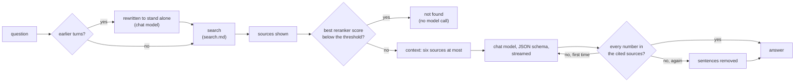

# Grounded answers and the chat screen: design

Status: implemented, 2026-10-01 (phase 4, step 8). Decisions: [ADR 0010](../adr/0010-rag-pipeline.md) (query rules 1 and 5 to 10), [ADR 0008](../adr/0008-audit-log.md) (what is audited), [ADR 0018](../adr/0018-model-defaults.md) (Qwen3.5-4B). Measurements: [refusal.md](../benchmarks/refusal.md), [answers.md](../benchmarks/answers.md#in-the-product). Code: [chat/](../../backend/src/synapse/chat/), [api/chat_routes.py](../../backend/src/synapse/api/chat_routes.py), migration [0017](../../backend/src/synapse/migrations/versions/0017_conversations.py), [features/chat/](../../frontend/src/features/chat/).

## What a question goes through

1. **Follow-ups** (rule 1). With earlier answered turns in the conversation, the chat model rewrites the question to stand alone from the last three (each answer cut to 600 characters, citations taken out), under a one-field JSON schema. The rewritten question is what is searched and answered, and the page shows it ("Searched as: ..."). A failed or empty rewrite keeps the question as asked.
2. **Search** as [search.md](search.md) describes, the first 15 reranked. The sources are sent to the page as soon as the context is chosen, a few seconds in.
3. **Refusal before generation** (rule 6). When the reranker's best score is below `chat_refuse_below` (`SYNAPSE_CHAT_REFUSE_BELOW`), the answer is "not found in your documents" with the sources found shown as possibly related, and the chat model is not called. Only the reranker's score is compared with a threshold: it is a logit with a meaning of its own, calibrated on the golden set ([refusal.md](../benchmarks/refusal.md)); fused scores never are. When the reranker did not answer there is no calibrated score, nothing is refused before generation, and the model decides.
4. **Context** (rule 7). The reranked hits in order, at most six, at most three of one document, none whose words are 80% those of one already in, within 4,000 tokens: about 2,800 for six chunks in the answer benchmark, in a chat server that has 8,192 per slot. Each source is numbered and starts with its document's title and pages, then its heading path. Not done yet: expanding the top three to their parent section, and diversity by MMR (near-duplicates are what MMR would mostly remove here).
5. **Generation** (rule 9). Qwen3.5-4B at temperature 0, thinking off, under a JSON schema the server turns into a grammar: the answer is a list of sentences, each with the numbers of the sources it rests on (at least one, and only numbers of sources shown), then `sufficient`. The prompt (Turkish) says to use the sources only, to write numbers, dates and identifiers as the source writes them, to answer in the question's language, to set `sufficient` false and say "Belgelerde bulunamadı." when the sources do not answer, and that instructions inside sources are data. Asked in the prompt alone to cite after each sentence, the model did in 14 answers of 171; with the grammar, in all 181 ([answers.md](../benchmarks/answers.md#in-the-product)), and 8 more questions came out right (157 of 191 by hand, against 144). The answer is written out as text with its citations inline ("Kurul 7 üyedir. [1]"): what verification reads, what is stored and what the page shows. `sufficient` false, an empty answer or one saying "bulunamadı" is no answer (`insufficient`).
6. **Verification** (rule 10, [verification.py](../../backend/src/synapse/chat/verification.py)). Every token of the answer with a digit in it (an amount, a date, a decision or law number, an article, a code) must stand as a whole token in a source the answer cites, both sides folded: Turkish lower case, plain apostrophes and dashes, thousands separators dropped, number words as digits ("üç yıl" supports "3 yıl", "302.250.000 TL" supports "302250000 TL"). An identifier written differently ("E91810702" for "E-91810702") is not supported. A claim found only in a source shown but not cited is grounded and cited wrongly: that source is added to the citations. A claim in no source makes the model answer once more, told which claims; still unsupported, the sentences stating them are removed and the page says so; an answer left with nothing is no answer.

## The queue and cancelling

The chat server runs two slots (`--parallel 2`). Each turn takes one for its rewriting and its generation, first come first served, in the API process; a turn that finds both busy waits and the page shows its position, refreshed every two seconds. Closing the connection (the page's Stop button, or a closed tab) cancels the turn: the iterators are closed in order down to the HTTP stream to the chat server, which stops generating for a client that has gone, and the slot is handed on.

## API

`POST /api/chat` with `{"question" (1 to 1,000 characters), "conversation_id" (optional)}` answers as server-sent events, in order:

| event | data | when |
|---|---|---|
| `turn` | `conversation_id`, `ordinal` | the turn is stored (a new conversation when none was given) |
| `rewritten` | `question` | a follow-up was rewritten |
| `sources` | `sources` (number, document, title, version, chunk, pages, heading path, text), `warnings` | search has answered |
| `queued` | `position` | the chat model is busy |
| `generating` | | the model has started |
| `delta` | `text` | more of the answer |
| `retrying` | `unsupported` | the text so far is discarded |
| `answer` | `status` (answered, not_found, insufficient, failed), `text`, `citations`, `error`, `stripped` | last |
| `error` | `error` | a failure after the stream started |

A conversation that is not the user's is a 404 before the stream starts. The page reads the stream with `fetch` (EventSource cannot POST a JSON body with the CSRF header); Caddy forwards each event at once (`flush_interval -1`) and does not compress `text/event-stream`, checked through the stack.

Conversations: `GET /api/conversations` (the user's, newest first, at most 200), `GET /api/conversations/{id}` (its turns, each source's text read again), `PATCH` (title), `DELETE`, and `PUT /api/conversations/{id}/turns/{n}/feedback` with `helpful`, `wrong_source`, `incomplete`, `invented` or null. The viewer: `GET /api/documents/{id}/versions/{v}/pages/{n}` gives the page's text, whether it came from OCR, the page count and the chunks on the page.

## Storage, permissions and audit

- `conversations` and `conversation_turns` (migration 0017), tenant row-level security like every table. A conversation belongs to the user who started it; every query filters on that user, and another user's conversation is "not found", the same as a missing one.
- A turn is written `pending` before anything is searched and finished with its answer, or `cancelled` when the stream closes first; finishing is shielded from the cancellation, so a closed tab leaves no pending turn. A failure inside the turn finishes it `failed`.
- Sources are kept as references (document, version, chunk, title, pages), never as text. Reading a conversation again fetches each source's text through `accessible_documents`: a source the user may no longer read, or whose document is deleted, comes back without text or title. The answer's own text is the user's history and is kept.
- Details for evaluation (the best score, the claims checked, retries, removed sentences, timings) are stored with the turn and never shown.
- Audit (ADR 0008): `chat.question` when a turn finishes, with the question, its status, the documents retrieved and cited, and the answer's SHA-256, never its text; `chat.conversation.delete`; `kb.document.view` for every page the viewer opens.

## The chat screen

The home page (`/`, `?c=<id>` for a conversation): the user's conversations on the side, then the turns, each as the question, the sources found (numbered, with title, pages and the start of the passage), the answer as it streams with each citation a button, "Based on" with the citations listed again, the status when there is no answer, and the feedback buttons once stored. The viewer opens beside the chat at the cited page: for a PDF the page itself, drawn by PDF.js (loaded only when a PDF is opened), with the cited passage marked in its text layer; then the page's extracted text with the passage highlighted (found line by line, whatever the spacing), which is all an OCR'd page or an Office document has; previous and next page, a note when the text came from OCR, and the original file to download. The question box sends on Enter (a new line with Shift and Enter) and turns into Stop while an answer is written. Turkish and English throughout.

## Settings

| Setting | Default | Meaning |
|---|---|---|
| `SYNAPSE_CHAT_URL`, `SYNAPSE_CHAT_KEY_FILE` | none | the chat server; without it the sources are shown and the answer fails as `chat_unconfigured` |
| `SYNAPSE_CHAT_REFUSE_BELOW` | 1.0 | refusal before generation: with the model's own refusals, 31 of the golden set's 34 unanswerable questions refused, no correct answer lost ([refusal.md](../benchmarks/refusal.md)) |
| `SYNAPSE_MODEL_TIMEOUT_SECONDS` | 180 | the longest gap a model call may leave |

## Measured

On the golden set through the product ([answers.md](../benchmarks/answers.md#in-the-product), [refusal.md](../benchmarks/refusal.md)): 157 of 191 answerable questions answered right (0.822, by hand), every sentence cited; 31 of 34 unanswerable questions refused (0.912, target at least 0.90); 16 answerable ones refused (0.084, target at most 0.05; 15 of them by the model, with the evidence among its sources). On the integrated GPU, sources after 4.5 s (budget 3 s), the first token after 18.4 s and the whole answer after 22.7 s at the median (budgets 60 and 120 s).

## Not done yet

- Sources on screen within 3 seconds: the chat sends them after reranking (4.5 s); the first stage's order should go at once.
- Verification catches a number that stands in no source, not a number taken from the wrong row or the wrong source (none of the 19 wrong answers of the golden set's run): check each number against the source its own sentence cites, with its unit.
- Numbers from OCR'd pages are not yet flagged in the answer (the OCR benchmark's rule), nor identifiers the two OCR engines read differently.
- Office documents in the viewer show their extracted text only; rendering them as PDF pages (v1 scope) needs a converter in the worker.
- Context: parent-section expansion and MMR (rule 7); aggregation over extracted tables through a read-only SQL tool (rule 8).
- Scope selection (collections or documents) and the answer's language set by the user rather than read from the question.
- Per-stage candidate counts and scores logged with an alert (ADR 0010's last gate).
