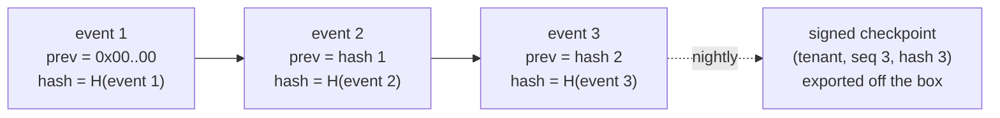

# Audit log: design and operation

Status: implemented, 2026-09-28. Decision record: [ADR 0008](../adr/0008-audit-log.md). Code: [backend/src/synapse/audit/](../../backend/src/synapse/audit/), table in migration [0004](../../backend/src/synapse/migrations/versions/0004_audit.py).

## What is recorded

| Action | Outcomes | Actor | Details |
|---|---|---|---|
| `identity.login` | success, failure, denied (throttled) | The account, when it exists | `auth_level` on success; `reason` and `email_sha256` otherwise |
| `identity.mfa.verify` | success, failure, denied | The account | `reason` on failure |
| `identity.mfa.enroll` | success, failure | The account | `method` |
| `identity.logout` | success | The account | |
| `identity.user.create` | success | The administrator, or none when created from the command line | `role`, `via` (`cli` or `admin`); target is the new user |

Every event also stores the client IP when there is one. For failed logins on unknown accounts only the SHA-256 of the typed address is kept, so a mistyped address never stores someone else's email. Document views, chat questions and permission changes are added to this table as those features land.

## How tampering is made evident



1. **One chain per tenant, gapless.** Each event gets the next sequence number and the previous event's hash. An advisory lock held for the rest of the transaction makes the chain single-writer, so concurrent requests cannot fork it (tested with 20 parallel writers).
2. **The hash covers every column** except the hash itself: tenant, sequence, id, time (UTC, microseconds), actor, IP, action, target, outcome, details, schema version and previous hash, serialized canonically ([canonical.py](../../backend/src/synapse/audit/canonical.py)).
3. **Same transaction as the action.** If the action rolls back, its event disappears with it; if the event cannot be written, the action fails.
4. **The database refuses changes.** Runtime roles have `INSERT` and `SELECT` only. A trigger rejects `UPDATE`, `DELETE` and `TRUNCATE` for everyone, including the table owner.
5. **Verification recomputes.** `synapse audit verify` recalculates every hash from the stored row and checks the links and the sequence. It reports the first broken event: `event N was modified`, `event N does not link to N-1`, or `sequence gap before event N`.
6. **Signed checkpoints leave the machine.** `synapse audit checkpoint` signs the current head (tenant, sequence, hash, time) with the instance's Ed25519 key. A database superuser could disable the trigger and rewrite the whole chain consistently; a checkpoint exported earlier then no longer matches, which proves the rewrite.

Tests that tamper on purpose, as a superuser with the trigger disabled: [tests/db/test_audit.py](../../backend/tests/db/test_audit.py).

## Operating it

```bash
synapse audit verify        # prints {"ok": ..., "events_checked": ..., "problem": ...}; exit 1 if broken
synapse audit checkpoint    # prints a signed checkpoint as JSON
```

Both need `SYNAPSE_TENANT_ID` and database settings; `checkpoint` also needs `SYNAPSE_AUDIT_SIGNING_KEY_FILE` (32-byte Ed25519 seed, generated by the installer).

## Not done yet

- The scheduler that runs `checkpoint` nightly and exports it (email, syslog or file), and a check that compares exported checkpoints with the live chain.
- The auditor's screen in the admin UI (read, filter, export as CSV and signed JSON).
- Retention: removing events older than the configured period needs a separate maintenance role and must itself be audited. Until then events are kept.
