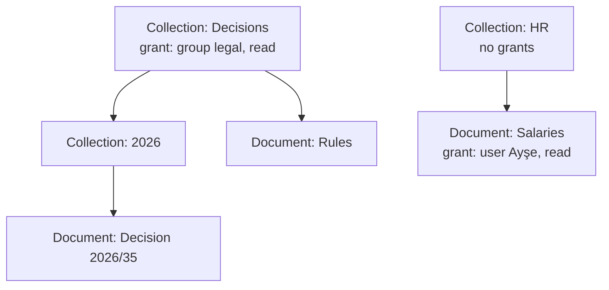

# Authorization: design

Status: implemented (model and checks), 2026-09-28. Decision record: [ADR 0007](../adr/0007-authorization.md). Code: [backend/src/synapse/authz/](../../backend/src/synapse/authz/), tables and the `accessible_documents` function in migration [0005](../../backend/src/synapse/migrations/versions/0005_authorization.py).

## Two kinds of permission

| Kind | Question it answers | Where it is decided |
|---|---|---|
| Role permissions | May this role do this action? (`users.manage`, `groups.manage`, `collections.create`, `settings.manage`, `audit.read`) | The `role_permissions` table, checked by `require("...")` on the route |
| Document permissions | May this user `read`, `write` or `manage` this document? | The SQL function `accessible_documents(user, permission)` |

Role permissions per role today:

| Role | Permissions |
|---|---|
| admin | users.manage, groups.manage, collections.create, settings.manage |
| editor | collections.create |
| member | none beyond the documents granted to them |
| auditor | audit.read |

Admins manage people and permissions, but **reading a document needs a grant like anyone else**. The auditor reads the audit log, not document content.

## Document permissions

- A grant names one principal (a user, a group or a role) and one level: `read`, `write` or `manage`. Higher levels include lower ones.
- A grant on a collection covers everything inside it, including nested collections. A grant on a document covers that document only.
- In the picture: members of `legal` can read both documents under Decisions; Ayşe can read Salaries; nobody else can read anything, admins included.
- Deleted documents and disabled users drop out immediately, because nothing is copied into a separate index.
- Grants cannot point into another tenant: every foreign key includes the tenant.

`accessible_documents` is the only definition of access. Search and chat will filter candidates with it inside the same SQL statement (a pre-filter), so there is no post-filter that could be skipped.

## Routes

Every route must declare how it is protected, and a test enforces it ([test_route_inventory.py](../../backend/tests/test_route_inventory.py)):

- `Depends(public_endpoint)`: deliberately reachable without a session (health checks, login).
- Any session dependency (`AnySession`, `FullSession`, `PendingSession`, `EnrollmentSession`).
- `require("permission")`: a full session whose role has the permission. A misspelled permission name fails when the route is defined.

The test also proves it can fail, with a route that forgets its guard.

## Not in this step

- Admin endpoints and screens for users, groups, collections and grants.
- Retrieval using `accessible_documents` (with the knowledge base).
- Audit events for permission changes (with the admin endpoints that make them).
