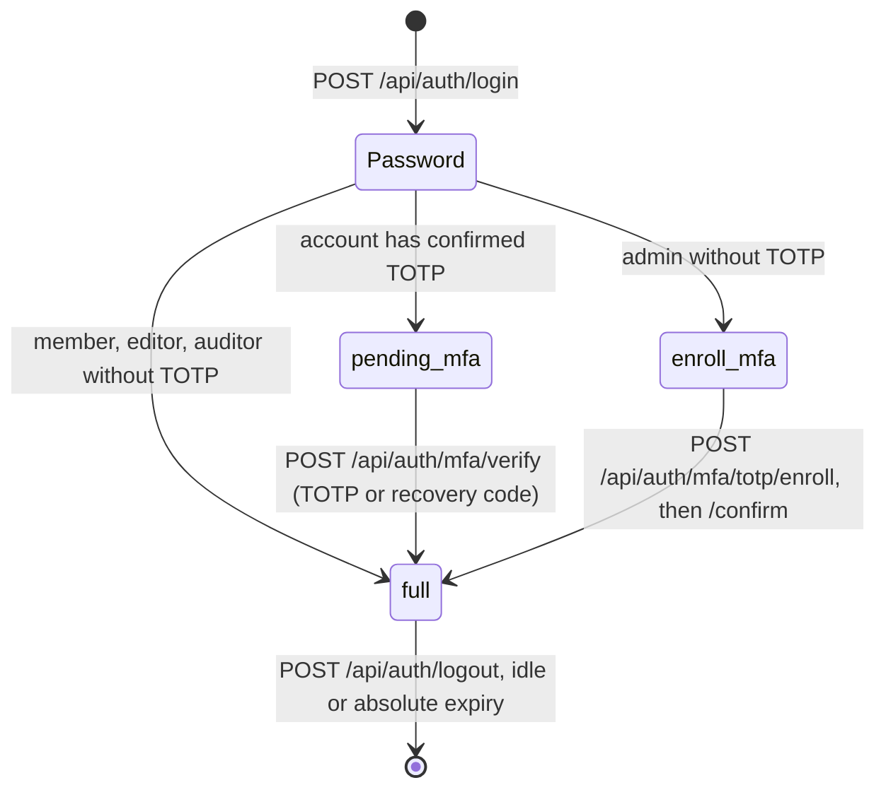

# Identity: design and API

Status: implemented, 2026-09-28. Decision record: [ADR 0006](../adr/0006-authentication.md). Code: [backend/src/synapse/identity/](../../backend/src/synapse/identity/), routes in [api/auth_routes.py](../../backend/src/synapse/api/auth_routes.py).

## Sign-in flow



Every step up to `full` **replaces the session token**. A token captured before the second factor stops working when the second factor is completed.

| Level | Lifetime | What it can do |
|---|---|---|
| `pending_mfa` | 5 minutes | Only `/mfa/verify`, `/session`, `/logout` |
| `enroll_mfa` | 15 minutes | Only the TOTP enrollment endpoints, `/session`, `/logout` |
| `full` | Idle 30 minutes, absolute 12 hours (both configurable) | Everything its role allows |

## Endpoints

All under `/api/auth`. Errors are `{"error": "<code>"}` with a stable code that the frontend translates.

| Method and path | Needs | Success | Errors |
|---|---|---|---|
| `POST /login` `{email, password}` | Header `X-Synapse-Client: web` | 200 `{auth_level, csrf_token}` and the session cookie | 401 `invalid_credentials`, 429 `too_many_attempts` (with `Retry-After`), 403 `client_header_missing` |
| `GET /session` | Any session | 200 `{auth_level, csrf_token, user}`; `user` only at `full` | 401 `not_authenticated` |
| `POST /logout` | Any session, CSRF header | 204, cookie cleared | 401, 403 `csrf_failed` |
| `POST /mfa/verify` `{code}` | `pending_mfa`, CSRF | 200 `{auth_level: "full", csrf_token}`, new cookie | 401 `invalid_credentials`, 429, 409 `no_second_factor_pending` |
| `POST /mfa/totp/enroll` | `enroll_mfa` or `full`, CSRF | 200 `{secret, provisioning_uri}` | 409 `totp_already_enrolled`, 403 `second_factor_required` |
| `POST /mfa/totp/confirm` `{code}` | `enroll_mfa` or `full`, CSRF | 200 `{auth_level, csrf_token, recovery_codes}`, new cookie | 400 `invalid_code` |

## Security properties and where they are enforced

| Property | Mechanism | Test |
|---|---|---|
| Stolen database rows do not give sessions | Only SHA-256 of the 256-bit cookie token is stored | `test_tokens_and_recovery.py` |
| Cookie cannot be read by scripts or sent cross-site on POST | `__Host-synapse_session`, `Secure`, `HttpOnly`, `SameSite=Lax`, `Path=/`, no `Domain` | `test_member_login_sets_a_hardened_cookie` |
| Cross-site request forgery | Every state-changing request with a session needs `X-Synapse-CSRF`, an HMAC of the session token under a server key; login needs `X-Synapse-Client`, which forces a CORS preflight that is never granted | `test_state_changing_requests_need_the_csrf_token`, `test_login_requires_the_client_header` |
| Responses do not reveal whether an account exists | One error for wrong password, unknown and disabled accounts; unknown accounts are verified against a dummy Argon2 hash so timing matches | `test_bad_credentials_get_one_generic_answer` |
| Password guessing | Per-account backoff after 4 failures (1 s doubling to 15 min); per-IP backoff after 50 (offices share addresses); also for unknown accounts; no permanent lockout | `test_repeated_failures_are_throttled_with_retry_after`, `test_throttle.py` |
| Admins cannot skip the second factor | Admin without TOTP gets `enroll_mfa`; there is no bypass setting in any environment | `test_admin_enrolls_totp_then_signs_in_with_it` |
| TOTP codes cannot be replayed | The accepted time step is claimed atomically in SQL; the same or an earlier step is rejected | `test_second_factor_is_required_and_codes_cannot_be_replayed` |
| A TOTP secret copied to another account is useless | AES-256-GCM with the user ID as associated data | `test_cipher_round_trip_is_bound_to_user` |
| Disabled accounts lose access immediately | Checked on every request, session revoked | `test_disabled_accounts_cannot_sign_in_and_lose_their_sessions` |
| Tenants cannot see each other's accounts or sessions | Forced row-level security on every identity table | `test_accounts_are_invisible_to_other_tenants` |
| Client IP values are real addresses | Anything that is not an IP address is dropped before it reaches the database | `test_client_ip_accepts_only_ip_addresses` |

## Passwords

- Policy: NIST SP 800-63B-4. At least 15 characters (8 when the account has MFA), at most 256, any characters including spaces, no composition rules, no expiry. Passwords containing the account's email name, display name or organization name are rejected.
- Hashing: Argon2id, `m=19 MiB, t=2, p=1` for now. Parameters live in each hash; when they are raised, hashes are upgraded on the next successful login. Hashing runs in a worker thread, never on the event loop.
- Not done yet: the breached-password list (ADR 0006). It needs a bundled offline list; choosing and licensing one is an open item.

## Recovery codes

Ten single-use codes of 16 characters (80 random bits), shown once after TOTP enrollment. They are stored as SHA-256 rather than Argon2 as ADR 0006 says: with 80 bits of entropy guessing is infeasible regardless of hash speed, and a SHA-256 value can be looked up directly instead of checking all ten stored codes with a slow hash on every attempt. Using a recovery code goes through the same throttle as TOTP codes.

## Creating the first administrator

There is no web endpoint for it. On the server:

```bash
synapse tenant create --slug acme --name "Acme"          # prints the tenant ID for SYNAPSE_TENANT_ID
synapse user create --email admin@acme.example --name "Admin" --role admin
```

The password is prompted twice (or read from `--password-file` for automation). At first sign-in the admin is sent through TOTP enrollment.

## Frontend

Code: [frontend/src/features/auth/](../../frontend/src/features/auth/), routes in [router.tsx](../../frontend/src/router.tsx).

| Route | Shown when | Page |
|---|---|---|
| `/login` | No session | Email and password |
| `/mfa` | `pending_mfa` | TOTP or recovery code |
| `/enroll` | `enroll_mfa` | QR code and manual key, code confirmation, then the recovery codes once |
| `/` | `full` | The application |

- Every route has the same guard: it loads the session and redirects to the page for its level, so a half-signed-in session can never reach the application, whatever URL is typed.
- The CSRF token is kept in memory only (never in `localStorage`), and the cookie is `HttpOnly`, so page scripts can read neither the session nor, after a reload, the CSRF token. `GET /api/auth/session` returns it again.
- The QR code is drawn by React from the code matrix; no generated markup is inserted into the page.
- While the recovery codes are on screen, leaving or reloading the page asks for confirmation, because they are shown only once.
- After login the session is fetched again, because the login response carries no account details.
- Known gap: the account's `locale` is not yet applied to the interface; the language choice is remembered per browser until the account settings screen exists.

## Audit

Every sign-in step, logout and account creation is written to the audit log in the same transaction; see [audit.md](audit.md).

## Not in this step

- Passkeys (WebAuthn): planned in the same ADR, after the audit log.
- Session list and revocation in the UI, password change and reset: with the account settings screens.
