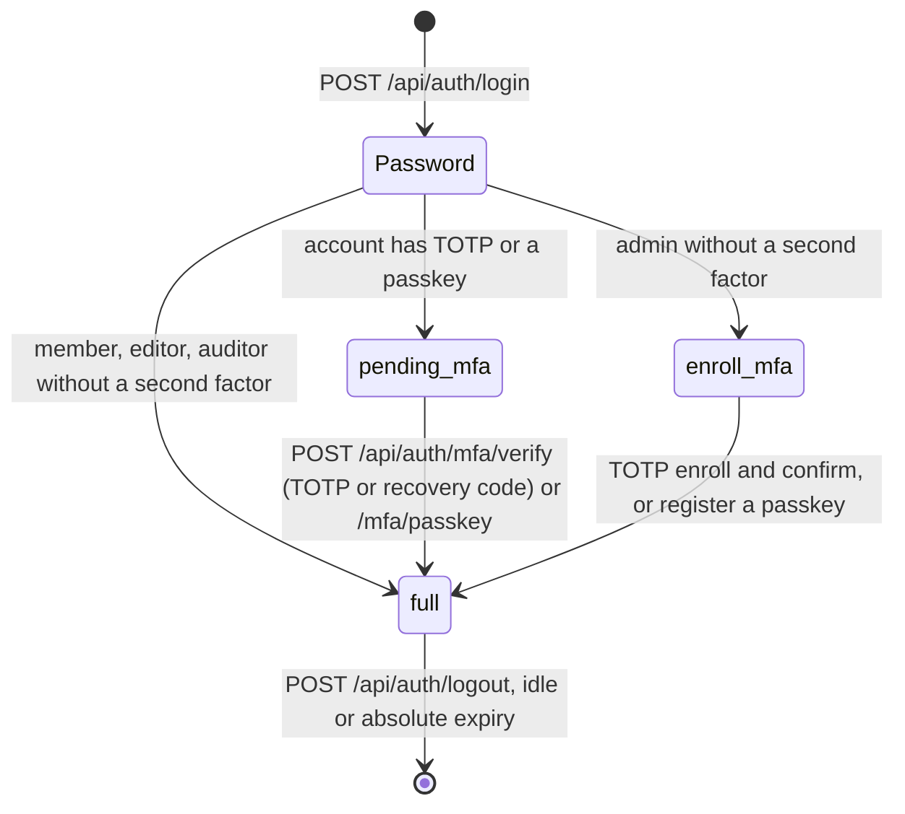

# Identity: design and API

Status: implemented, 2026-09-28. Decision record: [ADR 0006](../adr/0006-authentication.md). Code: [backend/src/synapse/identity/](../../backend/src/synapse/identity/), routes in [api/auth_routes.py](../../backend/src/synapse/api/auth_routes.py) and [api/passkey_routes.py](../../backend/src/synapse/api/passkey_routes.py).

## Sign-in flow



Every step up to `full` **replaces the session token**. A token captured before the second factor stops working when the second factor is completed.

| Level | Lifetime | What it can do |
|---|---|---|
| `pending_mfa` | 5 minutes | Only `/mfa/verify`, `/mfa/passkey*`, `/session`, `/logout` |
| `enroll_mfa` | 15 minutes | Only TOTP enrollment, passkey registration, `/session`, `/logout` |
| `full` | Idle 30 minutes, absolute 12 hours (both configurable) | Everything its role allows |

## Endpoints

All under `/api/auth`. Errors are `{"error": "<code>"}` with a stable code that the frontend translates.

| Method and path | Needs | Success | Errors |
|---|---|---|---|
| `POST /login` `{email, password}` | Header `X-Synapse-Client: web` | 200 `{auth_level, csrf_token}` and the session cookie | 401 `invalid_credentials`, 429 `too_many_attempts` (with `Retry-After`), 403 `client_header_missing` |
| `GET /session` | Any session | 200 `{auth_level, csrf_token, user, second_factors}`; `user` only at `full`, `second_factors` (`totp`, `passkey`) only at `pending_mfa` | 401 `not_authenticated` |
| `POST /logout` | Any session, CSRF header | 204, cookie cleared | 401, 403 `csrf_failed` |
| `POST /mfa/verify` `{code}` | `pending_mfa`, CSRF | 200 `{auth_level: "full", csrf_token}`, new cookie | 401 `invalid_credentials`, 429, 409 `no_second_factor_pending` |
| `POST /mfa/totp/enroll` | `enroll_mfa` or `full`, CSRF | 200 `{secret, provisioning_uri}` | 409 `totp_already_enrolled`, 403 `second_factor_required` |
| `POST /mfa/totp/confirm` `{code}` | `enroll_mfa` or `full`, CSRF | 200 `{auth_level, csrf_token, recovery_codes}`, new cookie | 400 `invalid_code` |
| `POST /passkeys/registration-options` | `enroll_mfa` or `full`, CSRF | 200 WebAuthn creation options | 409 `passkeys_unavailable` |
| `POST /passkeys` `{credential, name}` | `enroll_mfa` or `full`, CSRF | 201 `{id, recovery_codes, session}`; `session` and a new cookie when it completed enrollment | 400 `passkey_failed` |
| `POST /mfa/passkey/options` | `pending_mfa`, CSRF | 200 WebAuthn request options | 409 `no_passkey` |
| `POST /mfa/passkey` `{credential}` | `pending_mfa`, CSRF | 200 `{auth_level: "full", csrf_token}`, new cookie | 401 `passkey_failed`, 429 |

## Security properties and where they are enforced

| Property | Mechanism | Test |
|---|---|---|
| Stolen database rows do not give sessions | Only SHA-256 of the 256-bit cookie token is stored | `test_tokens_and_recovery.py` |
| Cookie cannot be read by scripts or sent cross-site on POST | `__Host-synapse_session`, `Secure`, `HttpOnly`, `SameSite=Lax`, `Path=/`, no `Domain` | `test_member_login_sets_a_hardened_cookie` |
| Cross-site request forgery | Every state-changing request with a session needs `X-Synapse-CSRF`, an HMAC of the session token under a server key; login needs `X-Synapse-Client`, which forces a CORS preflight that is never granted | `test_state_changing_requests_need_the_csrf_token`, `test_login_requires_the_client_header` |
| Responses do not reveal whether an account exists | One error for wrong password, unknown and disabled accounts; unknown accounts are verified against a dummy Argon2 hash so timing matches | `test_bad_credentials_get_one_generic_answer` |
| Password guessing | Per-account backoff after 4 failures (1 s doubling to 15 min); per-IP backoff after 50 (offices share addresses); also for unknown accounts; no permanent lockout | `test_repeated_failures_are_throttled_with_retry_after`, `test_throttle.py` |
| Admins cannot skip the second factor | Admin without a second factor gets `enroll_mfa`; there is no bypass setting in any environment; an admin cannot remove their last passkey | `test_admin_enrolls_totp_then_signs_in_with_it`, `test_the_last_second_factor_of_an_administrator_stays` |
| TOTP codes cannot be replayed | The accepted time step is claimed atomically in SQL; the same or an earlier step is rejected | `test_second_factor_is_required_and_codes_cannot_be_replayed` |
| A passkey response is used at most once | The challenge is bound to the session and purpose and deleted by the first attempt, successful or not | `test_each_challenge_is_consumed_by_the_first_attempt`, `test_a_response_counts_only_for_the_session_that_asked` |
| Passkeys resist phishing and cloning | The origin and RP ID are checked, user verification is required, a signature counter that does not increase is rejected | `test_responses_for_another_site_or_without_verification_are_rejected`, `test_a_counter_that_does_not_increase_is_rejected` |
| A TOTP secret copied to another account is useless | AES-256-GCM with the user ID as associated data | `test_cipher_round_trip_is_bound_to_user` |
| Disabled accounts lose access immediately | Checked on every request, session revoked | `test_disabled_accounts_cannot_sign_in_and_lose_their_sessions` |
| Tenants cannot see each other's accounts or sessions | Forced row-level security on every identity table | `test_accounts_are_invisible_to_other_tenants` |
| Client IP values are real addresses | Anything that is not an IP address is dropped before it reaches the database | `test_client_ip_accepts_only_ip_addresses` |

## Passwords

- Policy: NIST SP 800-63B-4. At least 15 characters (8 when the account has MFA), at most 256, any characters including spaces, no composition rules, no expiry. Passwords containing the account's email name, display name or organization name are rejected.
- Hashing: Argon2id, `m=19 MiB, t=2, p=1` for now. Parameters live in each hash; when they are raised, hashes are upgraded on the next successful login. Hashing runs in a worker thread, never on the event loop.
- Not done yet: the breached-password list (ADR 0006). It needs a bundled offline list; choosing and licensing one is an open item.

## Recovery codes

Ten single-use codes of 16 characters (80 random bits), shown once with the account's first second factor (TOTP or passkey); enrolling TOTP later issues a new set. They are stored as SHA-256 rather than Argon2 as ADR 0006 says: with 80 bits of entropy guessing is infeasible regardless of hash speed, and a SHA-256 value can be looked up directly instead of checking all ten stored codes with a slow hash on every attempt. Using a recovery code goes through the same throttle as TOTP codes.

## Passkeys

Code: [passkeys.py](../../backend/src/synapse/identity/passkeys.py). Verification (signatures, origin, RP ID, CBOR, counters) is done by the [`webauthn`](https://github.com/duo-labs/py_webauthn) package; the web page uses [`@simplewebauthn/browser`](https://simplewebauthn.dev).

- **A second factor, not a replacement for the password yet.** A passkey stands in for the TOTP code, on the same pages and with the same throttle. Credentials are created as discoverable where the device allows, so passwordless sign-in can be added later without anyone registering again.
- **Bound to the address users open.** `SYNAPSE_PUBLIC_URL` (written by the installer from the host name and HTTPS port) gives the RP ID and the expected origin. If it is not set, the passkey endpoints answer 409 `passkeys_unavailable` and the page hides them. If the host name changes, existing passkeys stop working and users fall back to TOTP or a recovery code.
- **User verification required, no attestation.** The device must check a PIN or biometrics. Synapse does not ask which device model created the passkey: it does not need to know, and asking would reveal it.
- **Challenges** are 32 random bytes per session and purpose, valid for 5 minutes, and deleted by the first attempt, so a signed response can be used once and only in the session that asked for it.
- **Management** under `/api/account/passkeys`: `GET` lists name, whether it is synced (backed up in a password manager), creation and last use; `DELETE /{id}` removes one (404 for another user's). An administrator cannot remove their last second factor (409 `last_second_factor`). An administrator's second-factor reset removes passkeys too.

Audit actions: `identity.passkey.register` (with `backed_up`), `identity.passkey.remove`, and `identity.mfa.verify` with `method: passkey`.

Testing: the backend tests use a software authenticator ([tests/soft_authenticator.py](../../backend/tests/soft_authenticator.py)) with real ES256 keys, CBOR and signatures, so the real verification runs. The web flows were also checked in a browser against the real API with an equivalent WebCrypto authenticator installed in the page.

## Creating the first administrator

There is no web endpoint for it. `synapsectl apply --admin-email ... --admin-name ...` does it during installation ([installer.md](../installer.md)); by hand, on the server:

```bash
synapse tenant create --slug acme --name "Acme"          # prints the tenant ID for SYNAPSE_TENANT_ID
synapse user create --email admin@acme.example --name "Admin" --role admin
```

The password is prompted twice (or read from `--password-file` for automation). At first sign-in the admin is sent through second-factor enrollment (TOTP or a passkey).

## Frontend

Code: [frontend/src/features/auth/](../../frontend/src/features/auth/), routes in [router.tsx](../../frontend/src/router.tsx).

| Route | Shown when | Page |
|---|---|---|
| `/login` | No session | Email and password |
| `/mfa` | `pending_mfa` | TOTP or recovery code |
| `/enroll` | `enroll_mfa` | QR code and manual key, code confirmation, then the recovery codes once |
| `/` | `full` | The application |
| `/account` | `full` | Own password, sessions and language |

- Every route has the same guard: it loads the session and redirects to the page for its level, so a half-signed-in session can never reach the application, whatever URL is typed.
- The CSRF token is kept in memory only (never in `localStorage`), and the cookie is `HttpOnly`, so page scripts can read neither the session nor, after a reload, the CSRF token. `GET /api/auth/session` returns it again.
- The QR code is drawn by React from the code matrix; no generated markup is inserted into the page.
- While the recovery codes are on screen, leaving or reloading the page asks for confirmation, because they are shown only once.
- After login the session is fetched again, because the login response carries no account details.
- Language: when sign-in completes (on the login, second-factor or enrollment page, whichever comes last) the interface switches to the account's `locale`; the session carries the account only at the full level, so each of those pages applies it; choosing a language while signed in stores it on the account, so it follows the user to every browser. Before sign-in the choice is remembered per browser.

## Own account

`/api/account` (any fully signed-in user, on their own account only). Code: [profile.py](../../backend/src/synapse/identity/profile.py).

- `POST /password {current_password, new_password}`: the current password is checked and throttled like sign-in (400 `wrong_password`, then 429 with `Retry-After`); the new one follows the policy for the account's factors (422 with the policy code). **Every other session of the account ends**, the current one stays.
- `GET /sessions`: the account's active sessions with creation and last-seen time, client address, user agent and which one is current.
- `DELETE /sessions/{id}`: ends one of them. A session of another account answers 404, the same as a missing one, so session ids cannot be probed.
- `PUT /preferences {locale}`: `tr` or `en`.

Audit actions: `identity.password.change` (success and failure) and `identity.session.end`.

## Account administration

`/api/admin/users` (permission `users.manage`):

- `GET`: every account with its role, status, locale and whether it has a second factor.
- `POST {email, display_name, role, locale, password}`: creates an account under the password policy. Errors: 409 `email_taken`, 422 with the policy code (for example `password_too_short`).
- `PATCH /{id} {role?, status?}`: changes role or status. **The account's sessions end at once**, so new rights apply to the next request. The last active administrator cannot be demoted or disabled (409 `last_administrator`); the check runs inside the transaction with the administrator rows locked, so two concurrent changes cannot both pass.

- `POST /{id}/password {password}`: sets a password chosen by the administrator, for a user who has forgotten theirs. The policy applies (422 with its code), the account's sign-in throttling is cleared and **its sessions end**. The administrator passes the password on outside the system.
- `DELETE /{id}/mfa`: removes the authenticator and the recovery codes, for a user who has lost both. **The account's sessions end**; if the role requires a second factor, the next sign-in goes to enrollment. The web page asks for a second click before sending it.
- Neither reset works on the administrator's own account (409 `own_account`): there the current password is required, so a stolen administrator session alone cannot take the account over. The web page does not offer them on one's own row.

Audit actions: `identity.user.create` (with `via: admin` or `cli`), `identity.user.update` (with the old and new values), `identity.password.reset` and `identity.mfa.reset`.

## Audit

Every sign-in step, logout and account creation is written to the audit log in the same transaction; see [audit.md](audit.md).

## Not in this step

- Passwordless sign-in with a passkey alone (the credentials are already discoverable).
- Password reset by email: needs outgoing mail, which on-prem installations may not have; until it exists, an administrator resets the password.
