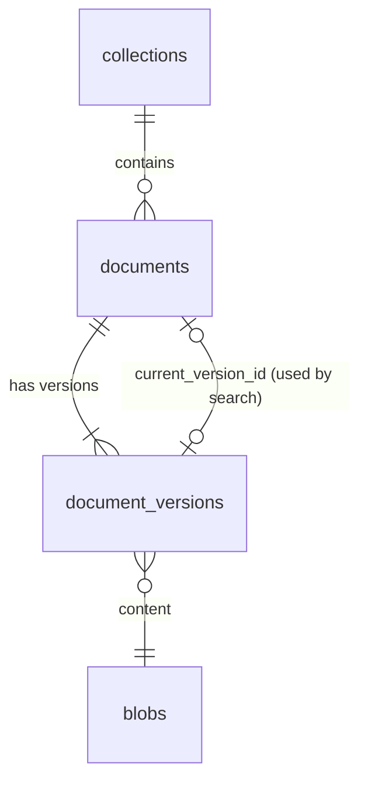

# Knowledge base: design

Status: storage and upload implemented, 2026-09-28 (phase 4, step 1 of [the plan](../plan/phase-4.md)). Decision records: [ADR 0003](../adr/0003-single-postgres-store.md), [ADR 0007](../adr/0007-authorization.md), [ADR 0010](../adr/0010-rag-pipeline.md). Code: [backend/src/synapse/knowledge/](../../backend/src/synapse/knowledge/), routes in [api/document_routes.py](../../backend/src/synapse/api/document_routes.py), tables in migration [0008](../../backend/src/synapse/migrations/versions/0008_documents.py).

## Model

- **Blob:** one row per distinct content per tenant, named by SHA-256. The bytes are in the blob store, not in the database.
- **Document:** a title in a collection. Deleting sets `deleted_at`; it leaves every list and every permission check at once.
- **Version:** each upload of a document, with the original file name and a processing status (`queued`, `parsing`, `ocr`, `embedding`, `ready`, `failed` with a reason code). Search will use `current_version_id`, which moves to a new version only when that version is `ready`, so re-uploading never leaves a document half indexed.

## Blob store

`BlobStore` is a port ([blobs.py](../../backend/src/synapse/knowledge/blobs.py)); the local adapter keeps files under `SYNAPSE_BLOB_DIR` (default `/var/lib/synapse/blobs`), as `<tenant>/<aa>/<bb>/<sha256>`. An S3-compatible adapter is for SaaS later.

- **Receiving:** the request body is written to `.incoming/` as it arrives, hashed and counted on the way. Past the limit (`SYNAPSE_UPLOAD_MAX_MB`, default 100) the partial file is deleted and the request answered with 413, so an oversized upload never fills the disk.
- **Storing:** the incoming file is renamed into place after `fsync`, on the same file system, so no reader ever sees a partial file. If the content is already stored, the new copy is dropped.
- **Deduplication stays inside a tenant.** Sharing blobs across tenants would let one tenant find out, by timing or by a missing upload, that another holds a given file.
- **Order of writes:** the blob row is inserted, then the file moved, inside the transaction that creates the document. A failed transaction can leave a file without a row; the maintenance job (step 2) removes those. The reverse, a row without a file, cannot happen.

## File types

Detected from the bytes ([filetypes.py](../../backend/src/synapse/knowledge/filetypes.py)), never from the name or the `Content-Type` header:

| Type | Recognised by |
|---|---|
| PDF | `%PDF-` within the first 1024 bytes |
| PNG, JPEG, TIFF | Magic numbers |
| DOCX, XLSX, PPTX | A zip whose `[Content_Types].xml` declares the Word, Excel or PowerPoint main part. Parsed with `defusedxml`, size-capped |

Refused, with a reason code the interface translates: legacy Office (`.doc`, `.xls`, `.ppt`, and password-protected Office files, which share the old container format) as `legacy_office`; macro-enabled Office files and anything else as `unknown_type`.

On the evaluation corpus, 97 of 100 files are recognised as the type the manifest lists. The other three are all `.doc`: one real legacy Word file, and two Word-saved HTML files in UTF-16 with a `.doc` name. Both kinds are outside v1 ([v1-scope.md](../product/v1-scope.md)).

## API

| Method and path | Needs | Result |
|---|---|---|
| `POST /api/collections/{id}/documents?filename=...&title=...` (body: the file) | `write` on the collection | 201 `{id, version_id, version, media_type}` |
| `POST /api/documents/{id}/versions?filename=...` (body: the file) | `write` on the document | 201, the next version number |
| `GET /api/collections/{id}/documents` | Session | The documents in it the user may read, with the latest version's status |
| `GET /api/documents/{id}/versions` | `read` | Every version, newest first |
| `GET /api/documents/{id}/versions/{n}/file` | `read` | The original file |
| `DELETE /api/documents/{id}` | `write` | 204 |

- The permission is checked before the body is received, and again in the transaction that writes.
- A document the user may not see answers 404, the same as a missing one.
- Errors: 404 `not_found`, 409 `duplicate_document` (the same content is already the latest version of a document in that collection), 413 `file_too_large`, 415 `unknown_type` or `legacy_office`, 400 `empty_file`.
- Downloads are always attachments, with `X-Content-Type-Options: nosniff` and `Content-Security-Policy: sandbox`, so an uploaded HTML or SVG file can never run in the application's origin.

Audit actions: `kb.document.create`, `kb.document.version`, `kb.document.delete`.

## Access

`accessible_collections(user, permission)` is new in migration 0008: the collections granted to the user, their groups or their role, and everything nested below. `accessible_documents` now uses it for its collection half, so there is still one definition of access; the existing permission tests pass unchanged against the rewritten function.

## Not in this step

- Processing: the job queue and worker (step 2), text extraction (step 3).
- The screens for browsing and uploading.
- Purging deleted documents' bytes, and removing files without a row.
- Per-document grants through the API, and editing titles and metadata.
