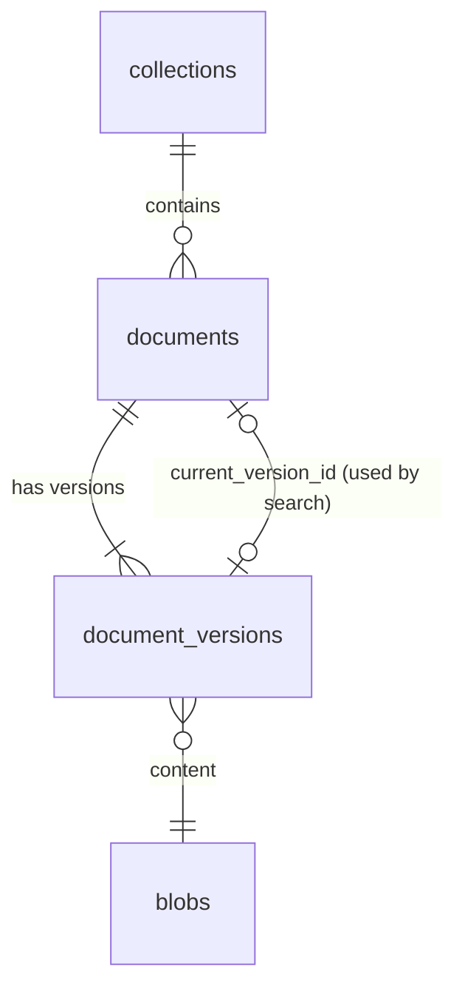

# Knowledge base: design

Status: storage, upload, the job queue, text extraction, the page quality check and OCR implemented, 2026-09-28 (phase 4, steps 1 to 4 of [the plan](../plan/phase-4.md)). Decision records: [ADR 0003](../adr/0003-single-postgres-store.md), [ADR 0007](../adr/0007-authorization.md), [ADR 0010](../adr/0010-rag-pipeline.md). Code: [backend/src/synapse/knowledge/](../../backend/src/synapse/knowledge/), routes in [api/document_routes.py](../../backend/src/synapse/api/document_routes.py), tables in migration [0008](../../backend/src/synapse/migrations/versions/0008_documents.py).

## Model



- **Blob:** one row per distinct content per tenant, named by SHA-256. The bytes are in the blob store, not in the database.
- **Document:** a title in a collection. Deleting sets `deleted_at`; it leaves every list and every permission check at once, and its content is purged soon after ([Deleting](#deleting)).
- **Version:** each upload of a document, with the original file name and a processing status (`queued`, `parsing`, `parsed`, `ocr`, `embedding`, `ready`, `failed` with a reason code). Search will use `current_version_id`, which moves to a new version only when that version is `ready`, so re-uploading never leaves a document half indexed.

## Blob store

`BlobStore` is a port ([blobs.py](../../backend/src/synapse/knowledge/blobs.py)); the local adapter keeps files under `SYNAPSE_BLOB_DIR` (default `/var/lib/synapse/blobs`), as `<tenant>/<aa>/<bb>/<sha256>`. An S3-compatible adapter is for SaaS later.

- **Receiving:** the request body is written to `.incoming/` as it arrives, hashed and counted on the way. Past the limit (`SYNAPSE_UPLOAD_MAX_MB`, default 100) the partial file is deleted and the request answered with 413, so an oversized upload never fills the disk.
- **Storing:** the incoming file is renamed into place after `fsync`, on the same file system, so no reader ever sees a partial file. If the content is already stored, the new copy is dropped.
- **Deduplication stays inside a tenant.** Sharing blobs across tenants would let one tenant find out, by timing or by a missing upload, that another holds a given file.
- **Order of writes:** the blob row is inserted, then the file moved, inside the transaction that creates the document. A failed transaction can leave a file without a row; the nightly sweep removes those ([Deleting](#deleting)). The reverse, a row without a file, cannot happen; the sweep counts them anyway and logs an error if it finds any.

## File types

Detected from the bytes ([filetypes.py](../../backend/src/synapse/knowledge/filetypes.py)), never from the name or the `Content-Type` header:

| Type | Recognised by |
|---|---|
| PDF | `%PDF-` within the first 1024 bytes |
| PNG, JPEG, TIFF | Magic numbers |
| DOCX, XLSX, PPTX | A zip whose `[Content_Types].xml` declares the Word, Excel or PowerPoint main part. Parsed with `defusedxml`, size-capped |

Refused, with a reason code the interface translates: legacy Office (`.doc`, `.xls`, `.ppt`, and password-protected Office files, which share the old container format) as `legacy_office`; macro-enabled Office files and anything else as `unknown_type`.

On the evaluation corpus, 97 of 100 files are recognised as the type the manifest lists. The other three are all `.doc`: one real legacy Word file, and two Word-saved HTML files in UTF-16 with a `.doc` name. Both kinds are outside v1 ([v1-scope.md](../product/v1-scope.md)).

## API

| Method and path | Needs | Result |
|---|---|---|
| `GET /api/collections` | Session | The collections the user may read, each with `can_write`. A collection whose parent the user cannot see is returned at the top level, so it still has a place in the tree |
| `POST /api/collections/{id}/documents?filename=...&title=...` (body: the file) | `write` on the collection | 201 `{id, version_id, version, media_type}` |
| `POST /api/documents/{id}/versions?filename=...` (body: the file) | `write` on the document | 201, the next version number |
| `GET /api/collections/{id}/documents` | Session | The documents in it the user may read, with the latest version's status and failure reason |
| `GET /api/documents/{id}/versions` | `read` | Every version, newest first |
| `GET /api/documents/{id}/versions/{n}/file` | `read` | The original file |
| `PATCH /api/documents/{id}` (body: any of `title`, `kind`, `document_date`, `reference`, `tags`) | `write` | 204; only the fields sent change |
| `DELETE /api/documents/{id}` | `write` | 204 |

- The permission is checked before the body is received, and again in the transaction that writes.
- A document the user may not see answers 404, the same as a missing one.
- The document list carries each document's `kind`, `document_date`, `reference` and `tags` ([Metadata](#metadata)).
- Errors: 404 `not_found`, 422 `invalid_metadata`, 409 `duplicate_document` (the same content is already the latest version of a document in that collection), 413 `file_too_large`, 415 `unknown_type` or `legacy_office`, 400 `empty_file`.
- Downloads are always attachments, with `X-Content-Type-Options: nosniff` and `Content-Security-Policy: sandbox`, so an uploaded HTML or SVG file can never run in the application's origin.

Audit actions: `kb.document.create`, `kb.document.version`, `kb.document.metadata` (the fields changed), `kb.document.delete`, and `kb.document.purge` from the scheduler (no actor; `versions` and `files_released`).

### An exception to ADR 0002, rule 3

ADR 0002 keeps parsing of untrusted files in the workers, so a crashing or memory-hungry parser cannot take the API down. Type detection is the one exception: to tell DOCX, XLSX and PPTX apart the API reads `[Content_Types].xml` from the zip package. It is pure Python, capped at 1 MB and parsed with `defusedxml`, so it can neither crash the process nor exhaust its memory, and in return the uploader gets "unsupported file" at once instead of a failed document later. Everything else, including opening the package's other parts, happens in the worker.

## Processing

```mermaid
sequenceDiagram
    participant API
    participant DB as PostgreSQL
    participant W as Worker
    API->>DB: document, version, blob row and job, in one transaction
    W->>DB: take the job; lock the version; status parsing
    W->>W: extract text (no transaction open)
    W->>DB: lock again, re-check the document; pages; status parsed, or ocr and an OCR job
    W->>W: OCR one page (no transaction open)
    W->>DB: lock, re-check; store the page; next page ... then chunks, status parsed, an embedding job
    W->>W: embed 16 chunks (the embedding server; no transaction open)
    W->>DB: lock, re-check; store their vectors; next batch ... then status ready
```

- **Jobs** ([jobs/](../../backend/src/synapse/jobs/), [ADR 0004](../adr/0004-job-queue.md)): Procrastinate on the main database. `enqueue` calls Procrastinate's `procrastinate_defer_jobs_v1` on the caller's own connection, so a job exists exactly when the rows it is about exist; a test rolls a transaction back and finds no job. Procrastinate's schema comes from migration 0009, pinned to 3.10.x; a different version stops the migration.
- **Task wrapper** ([worker.py](../../backend/src/synapse/jobs/worker.py)): takes the tenant from the job's arguments and drops a job without one (no retries). Errors are retried with exponential backoff, five runs in total; after the last one the task's give-up hook runs, which for parsing marks the version `failed` with `internal_error`, so nothing stays "in progress" forever.
- **One lock per document** (`document:<id>`): a document's jobs never run at the same time.
- **Parsing** ([processing.py](../../backend/src/synapse/knowledge/processing.py)): the text is extracted outside any transaction; the result is written only after the document is locked again and found not deleted, so a delete during parsing wins. A version whose document was deleted before its job ran is skipped.
- **The worker role** (`synapse worker [--queue ...] [--concurrency N]`) runs in its own container as the `synapse_worker` database role, with the blob volume mounted read-only.

### Text extraction

`LightParser` ([parsing.py](../../backend/src/synapse/knowledge/parsing.py)), behind the `Parser` port:

| Type | Unit | How |
|---|---|---|
| PDF | page | PDFium text layer, then the per-page quality check below |
| DOCX | document (one unit until Word files are rendered to pages) | Paragraphs and tables in order; headings marked with `#` so chunking can follow them |
| XLSX | sheet, with its name | Rows as tab-separated values; at most 500,000 cells per sheet |
| PPTX | slide | Text frames, tables and speaker notes |
| PNG, JPEG, TIFF | page | No text layer: one page marked `needs_ocr` |

Text is NFC-normalized, with Unix line ends and no control characters. Failures get reason codes: `unreadable`, `encrypted`, `too_many_pages`, `sheet_too_large`, and `suspicious_package` for Office files that expand to more than 1 GiB or more than 200 times their size (zip bombs). PDFium is not thread-safe, so every call into it goes through one lock.

On the evaluation corpus: 97 documents, 5,296 pages, in 8 seconds on the work laptop, with no errors.

### Page quality

A PDF page goes to OCR (`quality_issue` is set) when it has fewer than 20 visible characters (`no_text`), or when its text layer is unusable ([quality.py](../../backend/src/synapse/knowledge/quality.py)): letters that look like no language the model knows (`not_turkish_like`), or OCR artefacts inside words (`ocr_artefacts`). Case folding goes through [turkish.py](../../backend/src/synapse/knowledge/turkish.py), never `str.lower`. Method, thresholds and results: [page-quality.md](../benchmarks/page-quality.md). In short, 1.8% of clean pages are flagged; 37 of 53 pages of the worst scanned document are caught; and a born-digital PDF with a broken font encoding was found. Score and reason are stored per page.

Found by tests, not by the corpus run: openpyxl refuses a path that does not end in `.xlsx`, and blobs are stored under their hash, so spreadsheets are opened through a file handle.

### OCR

Chosen by benchmark ([ocr.md](../benchmarks/ocr.md)); code in [ocr.py](../../backend/src/synapse/knowledge/ocr.py), [ppocr.py](../../backend/src/synapse/knowledge/ppocr.py) ([ADR 0019](../adr/0019-page-ocr.md)) and [rapid.py](../../backend/src/synapse/knowledge/rapid.py), columns in migration [0012](../../backend/src/synapse/migrations/versions/0012_page_ocr.py).

- **When:** parsing ends in `ocr` instead of `parsed` when any page needs OCR, and enqueues `ingest.ocr_version` on the `ocr` queue (so a bigger machine can give OCR workers of their own), under the same per-document lock.
- **Rendering:** a scanned PDF page at the resolution of its embedded scan (at most 600 dpi), a page without one at 300 dpi, an uploaded image as it is. Enlarging low-resolution scans to 300 dpi made identifiers worse in the benchmark.
- **Three readings, at the same time:** PP-OCRv6's fine-tuned recogniser with a Turkish character language model, its Latin recogniser on the same lines, and Tesseract (best models, `tur+eng`) read the page, and the readings are voted word by word ([vote.py](../../backend/src/synapse/knowledge/vote.py), [ADR 0020](../adr/0020-ocr-vote.md)): the first is the frame, its lines and the punctuation around its words are kept. Tesseract's reading is also the second reading of the identifiers. Without the Latin recogniser's files PP-OCRv6 alone gives the text; without PP-OCRv6's models (a worker run on the host), Tesseract gives the text and RapidOCR the second reading. A "£" before a digit becomes "₺", which no model has. Identifiers missing from the text go to `extra_identifiers` (search terms only, never shown: two in five are wrong), and the text's identifiers the second reading lacks go to `uncertain_identifiers` (answers will flag them). `better_text` still decides whether the page keeps its text layer; if it does, both lists stay empty.
- **Isolation:** PP-OCRv6 (or RapidOCR) runs in one child process per worker, one page at a time, replaced every 25 pages and killed after 180 s on a page: its memory grows with every image size it sees (PP-OCRv6 and Tesseract together peaked at 1.2 GB with two pages at a time, RapidOCR alone at about 2 GB) and a native crash must not take the worker down. A page whose model outputs stay non-finite is read once more by a fresh child.
- **Resumable:** each page is written in its own transaction when it has been read; `ocr_engine` marks pages already read, so a retried job continues where the last run stopped, and a delete stops it at the next page. A page an engine fails on keeps its text; the version still ends `parsed`.
- `text_source` (`layer` or `ocr`) and `ocr_engine` record where every page's text came from (ADR 0010's answer rule: a number taken from an OCR'd page is flagged).

### Structure, chunks and entities

Phase 4, step 5 (ADR 0010, ingestion rules 6 to 9); code in [structure.py](../../backend/src/synapse/knowledge/structure.py), [headings.py](../../backend/src/synapse/knowledge/headings.py), [chunking.py](../../backend/src/synapse/knowledge/chunking.py), [entities.py](../../backend/src/synapse/knowledge/entities.py), [dedup.py](../../backend/src/synapse/knowledge/dedup.py); tables in migration [0013](../../backend/src/synapse/migrations/versions/0013_chunks.py).

- **Blocks:** every page stores its blocks in reading order (`document_pages.blocks`): headings with a level, paragraphs, list items, captions, footnotes, text inside figures, and tables as rows of cells with their header rows. Word, Excel and PowerPoint files give them directly (Word heading styles, a sheet's name, a slide's title; a merged cell's text kept once; a sheet's title and note rows above its table kept as paragraphs, not as the header). A PDF text layer and OCR output are plain lines: lines join into paragraphs, and list items, headings and articles are found by rule. A word hyphenated across lines is joined; a number ending a line with a hyphen before a line starting with a digit is joined keeping the hyphen, so an identifier broken there stays one token ("12/7/2013-6495/73", "E-81912396-105.04-2026.106304.1"; 95 such line ends in the corpus, every one read was one identifier or range). Page numbers ("3", "Sayfa 3 / 40") at a page's top or bottom are dropped, and a line repeated exactly at the top or bottom of at least half of a PDF's pages (the publisher, the document's title) is kept only where it first appears: 1.37% of the corpus's PDF lines. Lines differing only in a number ("KARAR SAYISI : 413") are content and stay; a first version that ignored digits would have dropped them. The page's own text is not changed.
- **Section levels** come from the documents' own conventions, not fonts: "BİRİNCİ KISIM" 1, "BÖLÜM" 2, "Madde 5 -" 3, numbered sections by depth ("3.2." is 3), capitals required for numbered and lettered headings in unmarked text, so list items are not taken for headings. The words are data ([data/language_tr.json](../../backend/src/synapse/knowledge/data/language_tr.json)); a tenant can bring its own. On the municipal law in the corpus: its 6 parts, 15 chapters and 102 articles (main, additional and provisional) found.
- **Chunks** (`document_chunks`), written when a version's pages are final (at the end of parsing, or of OCR), in the same transaction as the status: about 350 and at most 512 tokens; never across a level 1 or 2 heading, a deeper section starting a new chunk once the current one has 120 tokens; tables in groups of whole rows with the header rows repeated, a summary chunk for a split table, tables continued on the next page joined, and a row too long for a chunk (a spreadsheet note cell) split at sentences under its header and label. Headings are written at the start of the text that follows them, so a line taken for a heading by mistake loses nothing; headings just above a table stay in its heading path. Each chunk keeps its heading path (where it starts) and its pages. Every rule is a property test run on generated documents, and each was broken on purpose once to see its test fail.
- **Tokens** are estimated at 3.6 characters each: bge-m3's tokenizer (XLM-R's, [ADR 0018](../adr/0018-model-defaults.md)) gives 4.18 characters per token on the corpus's Turkish text at the median and 3.65 at the densest tenth of pages. The embedding adapter cuts at the model's own count, so the estimate only sizes chunks.
- **Entities** (`chunk_entities`): dates, decision numbers (including court docket and decision numbers), law numbers, articles, amounts and parcels, as written and normalised (`2025-03-15`, `E.2023/123`, `2500000.00 TRY`, `123/4`), with the rule words in the language data. They are read from the chunk's indexed text (its heading path, then its text), so a date in a heading is found too. Exact identifier lookup will read `(kind, value)`.
- **Duplicates:** `content_hash` (case and spacing folded, indexed) marks exact duplicates, `simhash` near ones; search will collapse them (step 7).
- **Document context.** A chunk does not say which document it comes from, and questions name the document (the municipality, the law, the year). Measured on the golden set with BM25: putting the file name and the document's first 30 words in front of every chunk raises Hit@1 from 0.57 to 0.66 and Hit@10 from 0.87 to 0.96 ([embeddings.md](../benchmarks/embeddings.md#document-context-in-every-chunk)). `document_context` builds it from what ingestion has (the upload's file name with separators as spaces, the first 30 words of the first five chunks together) and it is stored with the chunks (`document_versions.context`, migration [0014](../../backend/src/synapse/migrations/versions/0014_chunk_vectors.py)); embeddings are made from it and lexical search indexes it ([search.md](search.md)). The opening words come from pages with a text layer when the document has any: OCR'd cover pages read their logos as noise, which had stood in front of every chunk of 17 of the corpus's 97 documents.

On the corpus with the light parser (97 documents): 11,194 chunks, median 300 tokens, 90th percentile 347, none over 512; parsing 22 s, chunking 0.2 s, entities 3.9 s on the mini PC. In chunk text: 5,740 dates (the pages' text has 5,739; one is split over two lines there), 5,044 articles, 2,735 law numbers, 1,526 amounts, 863 decision numbers and 127 parcels. Checking these against the corpus found four faults, all fixed: rows of numbered tables in a PDF text layer ("1 AYHAN ŞAHİN 802 ...") taken for level 2 headings (179 in one report, their text kept only in heading paths); a spreadsheet's title row taken for its header and repeated in every row group (it had doubled the date count); court numbers written "E.: 2009/34"; parcel numbers with a thousands dot. A random sample of each entity kind was read in context.

Not in v1: Docling as the PDF parser (measured and not adopted, [parsing.md](../benchmarks/parsing.md)). Not yet: signature blocks as metadata, MinHash across documents, and the LLM document summary (ADR 0010, rule 9).

### Embeddings

Phase 4, step 6 ([ADR 0018](../adr/0018-model-defaults.md)); the job in [processing.py](../../backend/src/synapse/knowledge/processing.py), the model behind the `Embedder` port of [models/](../../backend/src/synapse/models/), columns in migration [0014](../../backend/src/synapse/migrations/versions/0014_chunk_vectors.py).

- **When:** a worker with an embedding model configured (`SYNAPSE_EMBED_URL`) enqueues `ingest.embed_version` on the `embed` queue in the transaction that stores a version's chunks, under the same per-document lock. Without one, versions stay `parsed`: their text is there, without vectors.
- **What is embedded:** each chunk's indexed text with its document's context in front (`contextual_text`), exactly what the benchmark measured; bge-m3's dense vector, stored at 16 bits (`document_chunks.embedding halfvec(1024)`, HNSW with cosine distance).
- **Statuses:** `parsed`, then `embedding` while the job runs, then `ready` with `embedded_with` naming the model (`bge-m3`): vectors of different models are never compared, and new chunks clear it.
- **Resumable:** batches of 16 chunks (the server's slots), each written in its own transaction after the document is found not deleted; a retried job embeds only the chunks still without a vector. Each update is guarded by the chunk's content hash too.
- **Failure:** the model's errors are typed (`ModelUnavailableError`, `ModelTimeoutError`, `ModelResponseError`) and retried like any other; after the last attempt the version goes back to `parsed` with `embedding_failure` (`model_unavailable`, `model_timeout`, `model_response`), not to `failed`: the document is fine and stays readable and searchable by words. `failure` keeps its meaning (the document is unusable; the schema allows it only with `failed`), and a later embedding job clears `embedding_failure`.
- **The adapter** ([llama.py](../../backend/src/synapse/models/llama.py)) cuts every text with the server's own tokenizer (`/tokenize`) to 512 tokens, keeping the end token, after collapsing runs of whitespace (llama.cpp's tokenizer does not always, and a table chunk once came out longer than the server's batch). It checks the dimension and makes every vector unit length.
- **Tests** use a stand-in model in the worker and a stand-in llama-server for the adapter; each rule was broken once on purpose to see a test fail (eight in the job, nine in the adapter).

## Metadata

A document has a kind ("Yönetmelik"), a date, a number ("2024/15") and up to 20 tags, besides its title ([metadata.py](../../backend/src/synapse/knowledge/metadata.py), migration 0026).

- **Suggested when it is read.** When a version's chunks are stored, its kind, date and number are suggested from the title and the first 1500 characters of the first page, where a decision or a regulation names, dates and numbers itself. The kind is the earliest of the kind words in [language_tr.json](../../backend/src/synapse/knowledge/data/language_tr.json) (`document_kinds`), the title first, the longer word first at the same place ("kararname" before "karar"). The date and the number are the first `date` and `decision_number` entities there. Only the newest version suggests; an older one finishing late changes nothing.
- **Set by a person.** `PATCH /api/documents/{id}` sets any of them. A kind, date or number a person set, or cleared, is never replaced by a suggestion again (`metadata_set_by_hand`), so a new version updates only what nobody touched. Texts are trimmed; an empty kind or number is cleared; tags are trimmed, each kept once, at most 50 characters. Tags come only from people.

## Deleting

The scheduler ([knowledge/maintenance.py](../../backend/src/synapse/knowledge/maintenance.py), `synapse scheduler`, its own database role and the only process besides the API that may write the blob volume) removes what a deleted document left:

1. **The rows, minutes after the delete.** The delete queues a purge job in its own transaction, under the document's lock. Procrastinate starts no job while an earlier job with the same lock is waiting or running, even one waiting for a retry, so the purge comes after every parsing, OCR or embedding job of the document. It deletes the versions with their pages, chunks and entities, the document with its grants, and the blob rows no other version names (the same bytes in another live document stay), and records `kb.document.purge` in the audit log, all in one transaction. The audit log keeps the upload, the delete and the purge, with the document's ID; conversations keep the answers they gave and the titles they cited.
2. **The files, after a day.** The nightly sweep (00:40 UTC) removes files no blob row has named for a day, and half-received uploads in `.incoming/` older than a day. Bytes stored again renew their file's time, and an upload takes the blob's advisory lock before it writes the row, as the sweep does before it removes a file, so a file being stored again is never removed.
3. **Late purges, every hour.** Deleted documents with no purge job waiting (deleted before purges existed, or whose purge failed five times) get one.

Backups keep deleted documents until their snapshots expire (six months by default, [backup.md](backup.md)). Tested in [tests/db/test_maintenance.py](../../backend/tests/db/test_maintenance.py) against the real queue and roles, and in the full-stack smoke test, where a deleted document must be purged within a minute.

## Screen

`/library` ("Belgeler", [frontend/src/features/library/](../../frontend/src/features/library/)), for every signed-in user:

- The collections the user can read, as a tree; choosing one lists its documents with translated status, size, date, a download link, and, where the user may write, a two-step delete.
- Where the user may write: an upload button and a drop zone. Files go one at a time, so each failure is shown next to its own file name (for example "notlar.pdf: Bu dosya türü desteklenmiyor.").
- While any document is being processed the list refreshes every 3 seconds, and stops when none is. Like any TanStack Query interval it pauses while the page is hidden and refreshes when it is shown again.

Checked in the browser against the real API and worker: uploading, a refused file, parsing to "Metin çıkarıldı", downloading and deleting.

## Access

`accessible_collections(user, permission)` is new in migration 0008: the collections granted to the user, their groups or their role, and everything nested below. `accessible_documents` now uses it for its collection half, so there is still one definition of access; the existing permission tests pass unchanged against the rewritten function.

## Not in this step

- Layout analysis (tables kept whole comes with chunking); chunking and indexing (step 5 on). Using `extra_identifiers` in search and `uncertain_identifiers` in answers (steps 7 and 8).
- Versions and titles on the screen (the API has versions already).
- Per-document grants through the API, and editing titles and metadata.
