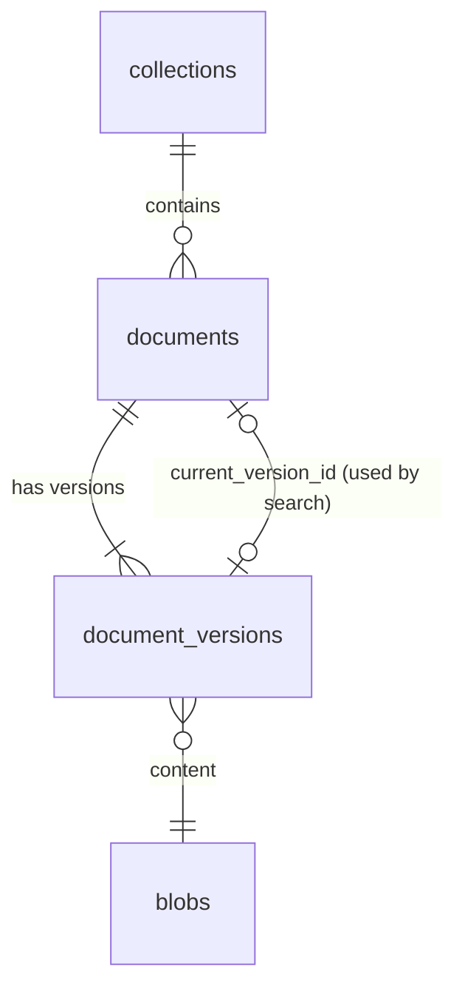

# Knowledge base: design

Status: storage, upload, the job queue and text extraction implemented, 2026-09-28 (phase 4, steps 1 to 3 of [the plan](../plan/phase-4.md)). Decision records: [ADR 0003](../adr/0003-single-postgres-store.md), [ADR 0007](../adr/0007-authorization.md), [ADR 0010](../adr/0010-rag-pipeline.md). Code: [backend/src/synapse/knowledge/](../../backend/src/synapse/knowledge/), routes in [api/document_routes.py](../../backend/src/synapse/api/document_routes.py), tables in migration [0008](../../backend/src/synapse/migrations/versions/0008_documents.py).

## Model



- **Blob:** one row per distinct content per tenant, named by SHA-256. The bytes are in the blob store, not in the database.
- **Document:** a title in a collection. Deleting sets `deleted_at`; it leaves every list and every permission check at once.
- **Version:** each upload of a document, with the original file name and a processing status (`queued`, `parsing`, `parsed`, `ocr`, `embedding`, `ready`, `failed` with a reason code). Search will use `current_version_id`, which moves to a new version only when that version is `ready`, so re-uploading never leaves a document half indexed.

## Blob store

`BlobStore` is a port ([blobs.py](../../backend/src/synapse/knowledge/blobs.py)); the local adapter keeps files under `SYNAPSE_BLOB_DIR` (default `/var/lib/synapse/blobs`), as `<tenant>/<aa>/<bb>/<sha256>`. An S3-compatible adapter is for SaaS later.

- **Receiving:** the request body is written to `.incoming/` as it arrives, hashed and counted on the way. Past the limit (`SYNAPSE_UPLOAD_MAX_MB`, default 100) the partial file is deleted and the request answered with 413, so an oversized upload never fills the disk.
- **Storing:** the incoming file is renamed into place after `fsync`, on the same file system, so no reader ever sees a partial file. If the content is already stored, the new copy is dropped.
- **Deduplication stays inside a tenant.** Sharing blobs across tenants would let one tenant find out, by timing or by a missing upload, that another holds a given file.
- **Order of writes:** the blob row is inserted, then the file moved, inside the transaction that creates the document. A failed transaction can leave a file without a row; the maintenance job (step 2) removes those. The reverse, a row without a file, cannot happen.

## File types

Detected from the bytes ([filetypes.py](../../backend/src/synapse/knowledge/filetypes.py)), never from the name or the `Content-Type` header:

| Type | Recognised by |
|---|---|
| PDF | `%PDF-` within the first 1024 bytes |
| PNG, JPEG, TIFF | Magic numbers |
| DOCX, XLSX, PPTX | A zip whose `[Content_Types].xml` declares the Word, Excel or PowerPoint main part. Parsed with `defusedxml`, size-capped |

Refused, with a reason code the interface translates: legacy Office (`.doc`, `.xls`, `.ppt`, and password-protected Office files, which share the old container format) as `legacy_office`; macro-enabled Office files and anything else as `unknown_type`.

On the evaluation corpus, 97 of 100 files are recognised as the type the manifest lists. The other three are all `.doc`: one real legacy Word file, and two Word-saved HTML files in UTF-16 with a `.doc` name. Both kinds are outside v1 ([v1-scope.md](../product/v1-scope.md)).

## API

| Method and path | Needs | Result |
|---|---|---|
| `GET /api/collections` | Session | The collections the user may read, each with `can_write`. A collection whose parent the user cannot see is returned at the top level, so it still has a place in the tree |
| `POST /api/collections/{id}/documents?filename=...&title=...` (body: the file) | `write` on the collection | 201 `{id, version_id, version, media_type}` |
| `POST /api/documents/{id}/versions?filename=...` (body: the file) | `write` on the document | 201, the next version number |
| `GET /api/collections/{id}/documents` | Session | The documents in it the user may read, with the latest version's status and failure reason |
| `GET /api/documents/{id}/versions` | `read` | Every version, newest first |
| `GET /api/documents/{id}/versions/{n}/file` | `read` | The original file |
| `DELETE /api/documents/{id}` | `write` | 204 |

- The permission is checked before the body is received, and again in the transaction that writes.
- A document the user may not see answers 404, the same as a missing one.
- Errors: 404 `not_found`, 409 `duplicate_document` (the same content is already the latest version of a document in that collection), 413 `file_too_large`, 415 `unknown_type` or `legacy_office`, 400 `empty_file`.
- Downloads are always attachments, with `X-Content-Type-Options: nosniff` and `Content-Security-Policy: sandbox`, so an uploaded HTML or SVG file can never run in the application's origin.

Audit actions: `kb.document.create`, `kb.document.version`, `kb.document.delete`.

### An exception to ADR 0002, rule 3

ADR 0002 keeps parsing of untrusted files in the workers, so a crashing or memory-hungry parser cannot take the API down. Type detection is the one exception: to tell DOCX, XLSX and PPTX apart the API reads `[Content_Types].xml` from the zip package. It is pure Python, capped at 1 MB and parsed with `defusedxml`, so it can neither crash the process nor exhaust its memory, and in return the uploader gets "unsupported file" at once instead of a failed document later. Everything else, including opening the package's other parts, happens in the worker.

## Processing

```mermaid
sequenceDiagram
    participant API
    participant DB as PostgreSQL
    participant W as Worker
    API->>DB: document, version, blob row and job, in one transaction
    W->>DB: take the job; lock the version; status parsing
    W->>W: extract text (no transaction open)
    W->>DB: lock again, re-check the document; pages; status parsed
```

- **Jobs** ([jobs/](../../backend/src/synapse/jobs/), [ADR 0004](../adr/0004-job-queue.md)): Procrastinate on the main database. `enqueue` calls Procrastinate's `procrastinate_defer_jobs_v1` on the caller's own connection, so a job exists exactly when the rows it is about exist; a test rolls a transaction back and finds no job. Procrastinate's schema comes from migration 0009, pinned to 3.10.x; a different version stops the migration.
- **Task wrapper** ([worker.py](../../backend/src/synapse/jobs/worker.py)): takes the tenant from the job's arguments and drops a job without one (no retries). Errors are retried with exponential backoff, five runs in total; after the last one the task's give-up hook runs, which for parsing marks the version `failed` with `internal_error`, so nothing stays "in progress" forever.
- **One lock per document** (`document:<id>`): a document's jobs never run at the same time.
- **Parsing** ([processing.py](../../backend/src/synapse/knowledge/processing.py)): the text is extracted outside any transaction; the result is written only after the document is locked again and found not deleted, so a delete during parsing wins. A version whose document was deleted before its job ran is skipped.
- **The worker role** (`synapse worker [--queue ...] [--concurrency N]`) runs in its own container as the `synapse_worker` database role, with the blob volume mounted read-only.

### Text extraction

`LightParser` ([parsing.py](../../backend/src/synapse/knowledge/parsing.py)), behind the `Parser` port:

| Type | Unit | How |
|---|---|---|
| PDF | page | PDFium text layer. A page with fewer than 20 visible characters is marked `needs_ocr` |
| DOCX | document (one unit until Word files are rendered to pages) | Paragraphs and tables in order; headings marked with `#` so chunking can follow them |
| XLSX | sheet, with its name | Rows as tab-separated values; at most 500,000 cells per sheet |
| PPTX | slide | Text frames, tables and speaker notes |
| PNG, JPEG, TIFF | page | No text layer: one page marked `needs_ocr` |

Text is NFC-normalized, with Unix line ends and no control characters. Failures get reason codes: `unreadable`, `encrypted`, `too_many_pages`, `sheet_too_large`, and `suspicious_package` for Office files that expand to more than 1 GiB or more than 200 times their size (zip bombs). PDFium is not thread-safe, so every call into it goes through one lock.

On the evaluation corpus: 97 documents, 5,296 pages, in 8 seconds on the work laptop, with no errors; 241 pages marked for OCR. Three scanned PDFs (doc-004, doc-056, doc-057) carry a noisy OCR text layer from the scanner and pass the character count. Catching those is the job of the per-page Turkish quality check in step 4.

Found by tests, not by the corpus run: openpyxl refuses a path that does not end in `.xlsx`, and blobs are stored under their hash, so spreadsheets are opened through a file handle.

## Screen

`/library` ("Belgeler", [frontend/src/features/library/](../../frontend/src/features/library/)), for every signed-in user:

- The collections the user can read, as a tree; choosing one lists its documents with translated status, size, date, a download link, and, where the user may write, a two-step delete.
- Where the user may write: an upload button and a drop zone. Files go one at a time, so each failure is shown next to its own file name (for example "notlar.pdf: Bu dosya türü desteklenmiyor.").
- While any document is being processed the list refreshes every 3 seconds, and stops when none is. Like any TanStack Query interval it pauses while the page is hidden and refreshes when it is shown again.

Checked in the browser against the real API and worker: uploading, a refused file, parsing to "Metin çıkarıldı", downloading and deleting.

## Access

`accessible_collections(user, permission)` is new in migration 0008: the collections granted to the user, their groups or their role, and everything nested below. `accessible_documents` now uses it for its collection half, so there is still one definition of access; the existing permission tests pass unchanged against the rewritten function.

## Not in this step

- OCR, layout analysis and the Turkish quality check (step 4); chunking and indexing (step 5 on).
- Versions and titles on the screen (the API has versions already).
- Purging deleted documents' bytes, and removing files without a row.
- Per-document grants through the API, and editing titles and metadata.
