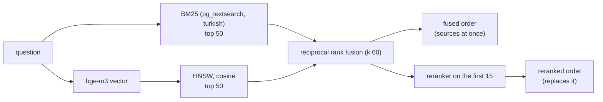

# Search: design

Status: implemented, 2026-10-01 (phase 4, step 7). Decisions: [ADR 0010](../adr/0010-rag-pipeline.md) (query rules), [ADR 0018](../adr/0018-model-defaults.md) (the first stage and the models). Measurements: [embeddings.md](../benchmarks/embeddings.md). Code: [knowledge/search.py](../../backend/src/synapse/knowledge/search.py), [api/search_routes.py](../../backend/src/synapse/api/search_routes.py), migrations [0015](../../backend/src/synapse/migrations/versions/0015_chunk_search.py) and [0016](../../backend/src/synapse/migrations/versions/0016_search_terms.py).

## What a search does

1. **Who may see what.** Both candidate queries start from the same set: for every document `accessible_documents(user, 'read')` gives, its newest version that is searchable (`parsed`, `embedding` or `ready`). A chunk outside it is never a candidate, however well it scores, and a deleted document or a replaced version drops out at once (nothing is copied into a separate index). This is a pre-filter inside each SQL statement, not a post-filter that could be skipped ([authorization.md](authorization.md)).
2. **By words.** `document_chunks.search` holds the lexical terms (`lexical_text`) of the document's context, the chunk's heading path and its text, written with the chunk: the text lower-cased the Turkish way in Python (`turkish.lower`: PostgreSQL's own `lower` makes "IĞDIR" "iğdir"), every word without a digit cut to its first five letters ("kararları" and "kararı" are "karar"), and every identifier of four characters or more also whole ("2026/16", "e-81912396-105.04"). A pg_textsearch BM25 index reads it with the `simple` configuration; the question becomes terms the same way. Five-letter prefixes rank above PostgreSQL's Snowball stems (the `turkish` configuration, migration 0015) on the golden set: measured below. A chunk holding none of the question's terms scores zero and is not a lexical candidate.
3. **By meaning.** bge-m3's vector of the question against the chunks' (`halfvec(1024)`, HNSW, cosine), with `ef_search` 200 and an iterative scan in strict order, so the permission filter cannot leave the list short.
4. **Fusion** by reciprocal rank of the two top-50 lists: ranks only, ties in order of first appearance. No score is compared with a threshold anywhere (ADR 0010): fused scores have no absolute meaning.
5. **Reranking.** bge-reranker-v2-m3 reads the question with each of the fusion's first 15 (the chunk as embedded: context, headings, text) and orders them; the rest follow in fused order. ADR 0018: the fused order is shown at once, the reranked one replaces it when it arrives.

A model that does not answer leaves its stage out and says so: `embedding_unavailable` (search by words alone) or `reranking_unavailable` (the fused order). The answer still comes, and the user sees what is missing (ADR 0009: model errors are shown, never swallowed).

## API

`POST /api/search` with `{"query", "limit" (1 to 50, default 10), "rerank" (default true)}`, for a signed-in user (POST so the question stays out of URLs and access logs). The answer has the hits (document, title, version, pages, kind, heading path, text, and each hit's rank in the lexical and dense lists), whether they were reranked, the warnings, and the milliseconds of each stage. With `rerank` false it returns the fused first stage, in tens of milliseconds; the chat screen (step 8) asks for that first and the reranked order after.

## Measured

**PostgreSQL's indexes** reproduce the benchmark's in-memory runs on the same 10,852 chunks ([eval/retrieval/postgres.py](../../eval/retrieval/postgres.py)), Hit@1 / Hit@10 and MRR@10:

| | as written | paraphrased |
|---|---|---|
| BM25 on PostgreSQL's `turkish` stems | 0.65 / 0.94, 0.752 | 0.27 / 0.57, 0.365 |
| BM25 on five-letter terms (what ships) | 0.65 / 0.96, 0.758 (in memory 0.66 / 0.96, 0.765) | 0.29 / 0.59, 0.381 (in memory 0.379) |
| bge-m3 by HNSW | 0.64 / 0.90, 0.729 (in memory the same) | 0.48 / 0.87, 0.607 |
| fused, stems | 0.70 / 0.94, 0.779 | 0.40 / 0.82, 0.514 |
| fused, five-letter terms | 0.67 / 0.95, 0.766 | 0.36 / 0.81, 0.493 |

Fused with five-letter terms, the evidence is among the fifteen the reranker reads for 0.969 of the questions as written (stems 0.953) and 0.874 of the paraphrased ones (the same). 6 ms per BM25 query and 25 ms per HNSW query on the reference machine; the indexes build in about 2 seconds each.

**The product, end to end** ([eval/retrieval/product.py](../../eval/retrieval/product.py)): the 97 corpus documents uploaded through the API of a stack with the model servers on the reference machine's integrated GPU, read, OCR'd where needed, chunked and embedded by the worker (60 minutes; 11,312 chunks, 437 of them from OCR'd pages, which the benchmark leaves out), then every question through `POST /api/search`:

| | as written | paraphrased | seconds per search |
|---|---|---|---|
| fused (first stage) | 0.67 / 0.94, 0.764 | 0.34 / 0.77, 0.467 | 0.07 |
| **reranked** | **0.75 / 0.97, 0.843** | **0.56 / 0.83, 0.656** | 4.5 |
| reranked, with Snowball stems | 0.75 / 0.94, 0.830 | 0.55 / 0.82, 0.648 | 4.5 |
| the benchmark's best (same path, its chunks) | 0.76 / 0.97, 0.853 | 0.60 / 0.86, 0.697 | 3.8 |

On questions worded like the source the product meets ADR 0010's targets (Hit@10 at least 0.95, Hit@1 at least 0.75); on paraphrased ones it does not. Multi-document questions: Hit@10 0.86 as written (0.71 with stems).

Found by this run and fixed: an OCR'd cover page made the document's context ("ISTATISTIKLERI YILLIĞI il ll \ WW | V ...") for 17 of the 97 documents; the opening words now come from pages with a text layer when there are any. Not every point of the gap to the benchmark is explained: of the questions the benchmark finds and the product does not, most have the right document found and another of its pages ranked above.

## Maintenance

`synapse knowledge reindex` (as the worker role) writes the lexical terms of chunks that lack them, in place, keeping chunks and vectors (migrations cannot: row-level security is forced on the migrator too, so 0016 empties the column by dropping it and the command fills it again: 97 versions in 15 seconds), and, with an embedding model configured, queues embedding for every version whose chunks lack vectors: installed before the models, or left with `embedding_failure`. It locks each version as the jobs do and touches only `parsed` and `ready` ones. **After upgrading past migration 0016, run it once.**

## Not done yet

- The exact identifier lookup of ADR 0010 (query rule 2): as a first stage it made ranking worse on the golden set in every variant ([embeddings.md](../benchmarks/embeddings.md#exact-identifier-lookup)); as a tie-breaker after reranking it lifts nothing either: the identifier questions it misses find the right document first, on another page that holds the same identifiers ([embeddings.md](../benchmarks/embeddings.md#exact-identifier-lookup)). What is left for identifier Hit@1 is the page within the document.
- OCR's `extra_identifiers` as search terms.
- At scale: BM25 statistics come from the whole index, so on a multi-tenant (SaaS) database every tenant's documents shape the others' term weights; and with the permission filter PostgreSQL scores every chunk of the searchable set, which is fast at 10,000 chunks and must be measured at 100,000.
- Collapsing duplicate chunks (`content_hash`, `simhash`) in the results.
