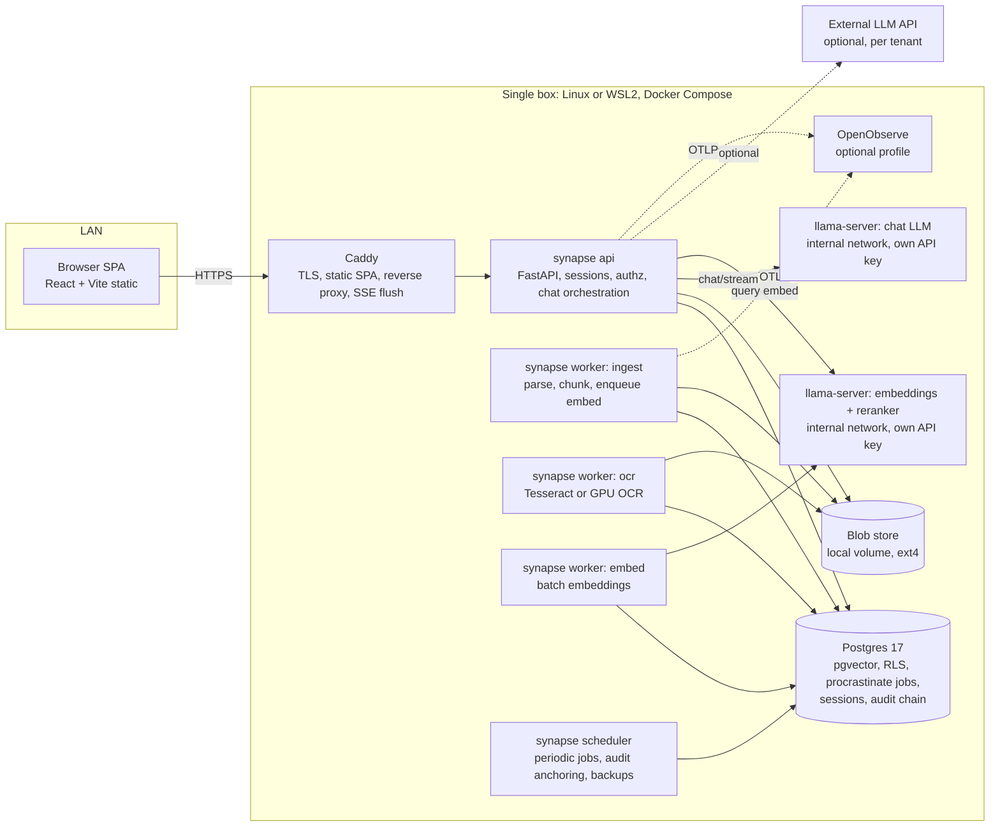

# 04. Software Architecture for Synapse

Status: research, 2026-09-28. Scope: process topology, queueing, tenancy, identity and authorization, frontend, installer and modules, security baseline, WSL2.

Design inputs: one CPU-only box (Ryzen 5 3600, 6 cores / 12 threads, 16 GB RAM minimum), Linux + Docker Compose, WSL2 compatibility path, optional GPU tier, local llama.cpp-class LLM, on-prem first with a SaaS edition from the same codebase, Python (FastAPI) backend and TypeScript frontend.

Common failure modes of comparable platforms that this document treats as hard requirements:

| Failure mode | Structural fix in Synapse |
|---|---|
| One shared internal secret across many services | No shared secret. Each process gets its own credential (own Postgres role, own API key for the model servers), generated at install time. |
| Identity passed in HTTP headers between services | Identity is resolved exactly once, in the API process, from a server-side session. Workers never accept identity from callers; they read job rows that record the actor. |
| Copy-pasted auth guards that diverged | One `authz` package with one `require()` dependency and one retrieval filter; a CI test fails if any route lacks it. |
| Config and secret drift between environments | One declarative instance file rendered by the installer; secrets generated, never typed by hand; a `doctor` command diffs expected vs actual. |
| No working CI | CI is a release gate from commit one (section 7). |
| Fail-open security checks | Default deny everywhere; exceptions in authz or guard code deny the request. |
| Vector index drifting from the DB | Vectors live in Postgres (pgvector), in the same transaction as the document rows. |
| Very large "god" files | Module boundaries enforced by import-linter; file length limit enforced in CI. |

---

## 1. Modular monolith vs microservices vs monolith + workers

### 1.1 Resource overhead on 16 GB

Every Python service costs a baseline even when idle: an interpreter with FastAPI, Pydantic, SQLAlchemy and an HTTP client typically sits at 80 to 150 MB RSS per process, more with multiple Uvicorn workers. Twenty Python services therefore burn roughly 2 to 3 GB before any real work, plus a connection pool each against Postgres (20 pools x 5 connections = 100 backends at roughly 5 to 10 MB each). On a 16 GB box where a quantized 8B model alone needs about 5 GB plus KV cache ([Codersera, Qwen3-8B on llama.cpp](https://codersera.com/blog/running-qwen3-8b-on-windows-a-comprehensive-guide/)), that overhead is the difference between fitting and swapping.

Self-hosted products show what happens when a SaaS architecture is shipped on-prem unchanged: Sentry self-hosted documents a 16 GB minimum but operators report 24 to 32 GB in practice because it runs Kafka, ClickHouse, Snuba, Relay and dozens of workers ([urgentry, Sentry self-hosted RAM](https://urgentry.com/guides/self-hosting/sentry-self-hosted-ram/), [Sentry develop docs](https://develop.sentry.dev/self-hosted/)). Plausible CE, by contrast, ships three containers and recommends 2 to 4 GB ([Plausible self-hosting](https://plausible.io/docs/self-hosting)).

### 1.2 Comparison

| Criterion | Microservices (about 20) | Pure monolith (one process) | Modular monolith + separate worker processes |
|---|---|---|---|
| Idle RAM overhead | 2 to 3 GB of interpreters + pools | about 0.3 GB | about 0.8 GB (API + 3 worker pools) |
| Failure isolation | Per service, but Postgres and the LLM are still shared SPOFs | None: an OCR segfault or OOM kills login | Per process class: OCR/ingest/LLM crash cannot kill the API |
| Internal auth surface | N x N service calls to secure (root of the old secret-sharing problem) | None | Only API to model servers, on a private network, per-process keys |
| Deploy/upgrade on customer box | Many images, version skew, many migrations | One image | One application image run in several roles + third-party images |
| Refactoring cost | High (network contracts) | Low | Low (in-process interfaces) |
| Observability | Needs distributed tracing to be usable | Easy | Easy; OTel spans cross process boundaries via job metadata |
| SaaS scaling | Fine grained | Coarse | Scale API replicas and each worker queue independently |

**Recommendation: modular monolith with separate worker processes.** One codebase, one application image, started in different roles (`api`, `worker --queue ingest`, `worker --queue ocr`, `scheduler`), plus off-the-shelf servers for the model runtimes and Postgres. This keeps the product owner's two real goals (independent failure domains and good logs/traces) while removing the N x N internal trust mesh that typically causes impersonation incidents. Failure isolation comes from OS processes and cgroups, not from network hops. Kraken runs a very large Python modular monolith with enforced boundaries for the same reasons ([Kraken on its Python monolith, EuroPython](https://blog.europython.eu/kraken-technologies-how-we-organize-our-very-large-pythonmonolith/)).

This lands at about 8 containers, well under the "20 or fewer" target, and any module can later be extracted into its own process because its interface already is a Python port.

### 1.3 Failure isolation inside a monolith

| Technique | How in Synapse |
|---|---|
| Process separation | API, ingest worker, OCR worker, scheduler, LLM server, embedding server each in its own container. Parsing untrusted PDFs/Office files only ever happens in workers. |
| Memory bulkheads | Compose `mem_limit` per container; OCR and ingest workers run with concurrency 1 to 2 and `max_tasks_per_child`-style recycling to shed leaks. An OOM kill restarts only that worker; the job is retried. |
| Supervision | Docker `restart: unless-stopped` + healthchecks; `depends_on: condition: service_healthy`. Inside workers, the queue library marks stalled jobs and retries them. |
| Timeouts everywhere | `httpx.Timeout(connect=2, read=N)` on every outbound call; per-job hard timeout; Postgres `statement_timeout` per role (API 10 s, workers longer). No call without a deadline. |
| Concurrency bulkheads | `asyncio.Semaphore` around LLM calls sized to llama-server `--parallel` slots, so a burst of chats queues instead of piling onto the model; a separate small semaphore for embeddings so ingestion cannot starve chat. |
| Circuit breakers | Wrap model server and external API clients (for example with `aiobreaker` or a 50-line in-house breaker). When open, chat returns "model busy, retry" and ingestion jobs are deferred rather than failed. |
| Priority | Chat embeddings and generation have priority over bulk ingestion; ingestion runs in its own queue with lower concurrency during office hours (scheduler adjusts). |
| Degraded modes | If the LLM is down, search still works (retrieval only, sources listed). If OCR is down, text-native documents still ingest. |

### 1.4 Observability without the LGTM stack

Prometheus + Loki + Tempo + Grafana is four stateful services and 1.5 to 3 GB of RAM; too much for the base tier. Options:

| Option | RAM idle | Notes |
|---|---|---|
| Structured JSON logs to Docker `json-file` with rotation + in-app Ops page | ~0 | Default. `structlog` with `trace_id`, `tenant_id`, `request_id`, `job_id` on every line. Ops page reads job tables and health endpoints. |
| OpenObserve (single Rust binary, OTLP native) | ~512 MB | Logs, metrics, traces in one process on local disk/Parquet ([OpenObserve vs SigNoz](https://openobserve.ai/blog/openobserve-vs-signoz/), [Netdata vs SigNoz vs OpenObserve](https://dev.to/morinaga/netdata-vs-signoz-vs-openobserve-self-hosted-observability-for-indie-projects-1mob)) |
| SigNoz | 1.5 to 2 GB | ClickHouse based; too heavy for 16 GB, fine for SaaS |
| Grafana LGTM | 1.5 to 3 GB | SaaS edition only |

**Recommendation:** instrument with the OpenTelemetry Python SDK (FastAPI, SQLAlchemy/psycopg, httpx instrumentations) from day one, export OTLP to a configurable endpoint, and propagate trace context through job payloads so an ingest trace spans API to worker. On-prem default ships logs only plus an optional `observability` Compose profile running OpenObserve. SaaS points the same OTLP exporter at SigNoz or a managed backend. Code is identical; only the endpoint differs.

### 1.5 Enforcing module boundaries in Python

Package layout (hexagonal / ports and adapters):

```
src/synapse/
  kernel/            # config, db session, tenancy context, logging, errors (no business logic)
  identity/          # users, sessions, MFA, passwords
  authz/             # roles, grants, document ACL, retrieval filter
  audit/             # append-only hash-chained log
  documents/         # upload, storage, versions, metadata
  ingestion/         # parse, OCR, chunk, embed pipeline (jobs)
  retrieval/         # hybrid search (pgvector + full text), rerank
  chat/              # conversations, RAG orchestration, streaming
  admin/             # instance settings, module registry, license
  ports/             # Protocols: LLMPort, EmbeddingPort, OCRPort, BlobStorePort
  adapters/          # llama_cpp, openai_compat, tesseract, local_fs, s3
  modules/           # optional: reports, spec_drafting, translation, calendar
```

Each package exposes a `public.py` (facade functions and DTOs); everything else is private. Enforcement with [import-linter](https://import-linter.readthedocs.io/en/v2.9/contract_types/layers/):

- `layers` contract: `modules` > `chat | ingestion | retrieval` > `documents | audit` > `authz | identity` > `ports` > `kernel`.
- `independence` contract between sibling domains, so they talk only via `public` facades.
- `forbidden` contract: nothing outside `adapters` imports `httpx`, `openai`, `pytesseract`; nothing outside a package imports its `models.py`.
- Optional modules may import core `public` APIs, never each other.

Add a CI check that fails on any Python file over 800 lines and any function over 80 lines (ruff `PLR0915` plus a small script). This is the direct countermeasure to god files.

---

## 2. Job queue for background ingestion

| Option | Broker | Status 2026 | Transactional enqueue with DB write | Fit |
|---|---|---|---|---|
| [Procrastinate](https://procrastinate.readthedocs.io/) | Postgres | Active, release Sept 2026 ([PyPI](https://pypi.org/project/procrastinate/)) | Yes | Async-native, retries, periodic tasks, locks, queue per worker, LISTEN/NOTIFY wake-up |
| [pgmq](https://github.com/pgmq/pgmq) | Postgres extension | Active | Yes | SQS-like primitives only (visibility timeout, archive); you build retries, scheduling, workers yourself |
| Raw `FOR UPDATE SKIP LOCKED` | Postgres | n/a | Yes | Proven pattern, fine to tens to low thousands of jobs/s ([MVP Factory](https://mvpfactory.io/blog/replacing-your-message-queue-with-postgresql-skip-locked-queues-listen-notify)), but you rewrite a queue library |
| arq | Redis | Maintenance only ([GitHub](https://github.com/python-arq/arq)) | No | Rejected |
| Dramatiq | Redis/RabbitMQ | Active | No | Solid, but adds Redis and dual-write |
| RQ | Redis | Active | No | Sync, simple, adds Redis |
| Celery | Redis/RabbitMQ | Active | No | Heavy, complex config, poor asyncio story |

Ingestion jobs are low volume (hundreds to low thousands per day on-prem) and long running (seconds to minutes). Throughput is irrelevant; correctness is everything: "document row committed but job lost" or "job ran for a document that rolled back" are exactly the drift bugs to avoid. Only a Postgres queue gives enqueue-in-the-same-transaction.

**Recommendation: Procrastinate on the main Postgres.** Queues: `ingest`, `ocr`, `embed`, `maintenance`, one worker container per queue class. Each job row carries `tenant_id`, `actor_id`, `trace_context`; the task wrapper sets the tenant GUC (section 3) before touching data. Use Procrastinate `lock` per document id so re-ingest and delete cannot race.

**Is Redis needed? No.** Sessions live in Postgres, rate-limit counters live in Postgres (or in-process for single-replica on-prem), caches are in-process (`cachetools`) with short TTLs. Dropping Redis removes one stateful service, one password, and one backup target. The SaaS edition can add Redis later behind a `CachePort` if profiling shows need.

---

## 3. Multi-tenancy from one codebase

| Model | Isolation | Ops cost at 500 tenants | Migrations | Fit |
|---|---|---|---|---|
| Shared schema + `tenant_id` + RLS | Logical, enforced by DB | Lowest | One run | Default SaaS |
| Schema per tenant | Stronger | Catalog bloat, N migration runs | N runs | Poor fit for small tenants |
| Database per tenant | Strongest | High | N runs | Only for large regulated tenants |
| Dedicated instance (same artifact as on-prem, vendor hosted) | Full | Per customer | Per instance | "Private cloud" tier for hospitals and law firms |

**Recommendation:** every tenant-owned table has `tenant_id uuid not null`, RLS enabled and `FORCE ROW LEVEL SECURITY`, policy `tenant_id = current_setting('app.tenant_id')::uuid`. The app sets it with `set_config('app.tenant_id', $1, true)` at the start of every transaction, which is transaction-scoped and therefore safe with PgBouncer transaction pooling ([patotski.com on RLS footguns](https://patotski.com/blog/postgres-row-level-security-multi-tenant/), [The Road to Enterprise](https://theroadtoenterprise.com/blog/postgres-rls-multi-tenant-saas)). If the setting is missing, `current_setting(..., true)` returns null and the policy matches nothing: fail closed. The application DB role is not the table owner and has no `BYPASSRLS`.

Keeping on-prem free of SaaS complexity:

- On-prem is simply "one tenant". The installer creates a single tenant row; the tenancy middleware resolves it from config rather than from the hostname. Same code path, same RLS, so RLS is tested on every install rather than only in SaaS.
- SaaS-only concerns (tenant signup, billing, per-tenant quotas, subdomain routing, PgBouncer) live in a `saas` package that the on-prem build does not enable, guarded by import-linter so core never imports it.
- Background jobs: tenant id is a mandatory job argument validated by the task decorator; a job without it is rejected, never run with "no tenant".
- Blob storage keys are prefixed `tenants/{tenant_id}/`, and caches are keyed by tenant. Vectors are in the RLS-protected `chunks` table, so there is no separate vector index to namespace.
- The "dedicated instance" tier reuses the on-prem artifact, which covers customers who contractually need physical separation.

---

## 4. Authentication and authorization

### 4.1 Local authentication

| Topic | Decision | Source / reasoning |
|---|---|---|
| Hashing | Argon2id via `argon2-cffi`, m=19456 KiB, t=2, p=1 minimum; benchmark on the Ryzen and raise m to about 64 MiB if login stays under 250 ms. Store params in the hash, rehash on login when params change. | [OWASP Password Storage Cheat Sheet](https://cheatsheetseries.owasp.org/cheatsheets/Password_Storage_Cheat_Sheet.html) |
| Password policy | NIST SP 800-63B-4 (final July 2025): minimum 15 characters when password is the only factor, 8 when used with MFA; accept at least 64 characters, spaces and Unicode; no composition rules; no periodic rotation; block known-breached and context words (product, institution name). Ship an offline breached-password list (for example a k-anonymity HIBP range dump or top-1M list) since on-prem may be offline. | [NIST SP 800-63B-4](https://csrc.nist.gov/pubs/sp/800/63/b/4/final), [Enzoic summary](https://www.enzoic.com/blog/nist-sp-800-63b-rev4/) |
| Session vs JWT | Server-side sessions: 256-bit random token in a `__Host-synapse_session` cookie (`Secure`, `HttpOnly`, `SameSite=Lax`, `Path=/`), only its SHA-256 stored in Postgres with idle (30 min) and absolute (12 h) expiry. JWTs add revocation problems and nothing for a first-party SPA on the same origin. | Revocation on logout/role change is instant; no signing key to leak |
| CSRF | SameSite=Lax plus a required custom header (`X-Synapse-CSRF` bound to the session) on every state-changing request. | Defense in depth |
| MFA | TOTP with `pyotp` (RFC 6238, secret encrypted at rest, one-time recovery codes hashed with Argon2). WebAuthn/passkeys with [`py_webauthn`](https://github.com/duo-labs/py_webauthn) (actively maintained, 2026 release). Admin roles require MFA. | Passkeys are phishing resistant and satisfy 800-63B AAL2/AAL3 paths |
| Rate limiting and lockout | Per-account and per-IP throttling with exponential backoff (1 s, 2 s, 4 s... capped at 15 min) instead of permanent lockout, which is a DoS vector. NIST caps consecutive failures on an account at 100; Synapse will be stricter (backoff from 5 failures, admin notification at 20). Throttle also on `/password-reset` and MFA verification. | [NIST SP 800-63B-4](https://csrc.nist.gov/pubs/sp/800/63/b/4/final) |
| Libraries | Do not build on `fastapi-users`: it is in maintenance mode with a successor toolkit announced ([fastapi-users](https://github.com/fastapi-users/fastapi-users)). Write a small `identity` package (about 1500 lines) on `argon2-cffi`, `pyotp`, `webauthn`. Use `authlib` for OIDC client later. | Auth is core IP; a thin, well-tested own layer beats a library that is freezing |
| OIDC later | `authlib` OIDC client with PKCE, mapping IdP groups to Synapse roles; local accounts remain for break-glass admin. | |

### 4.2 Authorization model

Requirements: roles (admin, editor, member, auditor), collections/folders, per-document grants to users, groups and roles, and, critically, filtering RAG retrieval by permission before the LLM sees any chunk.

| Option | Strength | Weakness at Synapse scale |
|---|---|---|
| Postgres ACL tables + RLS/SQL filter | Filtering happens inside the same SQL that does vector search; one transaction; no extra service | You write the model yourself |
| OpenFGA / SpiceDB (Zanzibar ReBAC) | Rich relationships, audited models | Extra stateful service, dual-write of relationships (a new drift source), "list objects" for RAG filtering is slow at retrieval time ([Oso on OpenFGA alternatives](https://www.osohq.com/learn/openfga-alternatives)) |
| Cerbos | Stateless policy engine, YAML policies | Still needs data for list filtering; query-plan feature adds complexity |
| Oso Cloud | Good list filtering | SaaS dependency, unsuitable for air-gapped |
| Casbin | Embedded library | Model strings are opaque; weak list filtering |

**Recommendation: Postgres-native RBAC + ACL.** Tables: `roles`, `role_permissions`, `group_members`, `collection_grants`, `document_grants(document_id, principal_type, principal_id, permission)`. A materialized per-request principal set (`user id + group ids + role ids`) is passed as an array parameter. Retrieval is one SQL statement:

```sql
SELECT c.id, c.text, c.embedding <=> $query AS dist
FROM chunks c
WHERE c.document_id IN (SELECT document_id FROM accessible_documents($principals, 'read'))
ORDER BY c.embedding <=> $query
LIMIT 40;
```

with pgvector iterative index scans (`SET hnsw.iterative_scan = relaxed_order`) so filtering does not starve results ([pgvector 0.8 release notes](https://www.postgresql.org/about/news/pgvector-080-released-2952)). The `authz` package exposes exactly two things: `require(permission, resource)` as a FastAPI dependency and `accessible_documents` for queries. A CI test enumerates all routes and fails if any route lacks an explicit `require` or `public` marker. Revisit OpenFGA only if SaaS customers need cross-organization sharing graphs.

### 4.3 Tamper-evident audit log

Done correctly, a hash chain needs all of the following (partial implementations hash only some columns, or verify by comparing stored values):

1. **Canonical serialization of every column** except `hash` itself: `id`, `seq`, `tenant_id`, `occurred_at` (UTC, microseconds, fixed format), `actor_id`, `actor_ip`, `action`, `target_type`, `target_id`, `outcome`, `details` (JSON canonicalized with RFC 8785 JCS), `prev_hash`. Include a `schema_version` so adding a column is explicit.
2. `hash = SHA-256(canonical_bytes)`; `prev_hash` is the previous row's hash in the same tenant chain.
3. **Single writer per chain**: take `pg_advisory_xact_lock(hashtext(tenant_id))` inside the insert transaction so two concurrent inserts cannot fork the chain; `seq` is gapless per tenant.
4. **Verification recomputes** the hash from row contents and checks it against both the stored hash and the next row's `prev_hash`, and checks `seq` continuity. Comparing stored hashes to each other proves nothing.
5. **DB permissions**: the app role has `INSERT, SELECT` only; `UPDATE`, `DELETE`, `TRUNCATE` revoked; a trigger rejects updates even for the owner in normal operation.
6. **Anchoring**: a nightly job signs the current head (`tenant_id, seq, hash, timestamp`) with the instance Ed25519 key and exports it (email to customer admin, syslog, or a file for the vendor). Without an external anchor, an attacker with DB superuser can rewrite the whole chain.
7. Audit writes for security events happen in the same transaction as the action; if the audit insert fails, the action fails (fail closed).

---

## 5. Frontend

| Criterion | Next.js | Vite + React SPA served statically | SvelteKit |
|---|---|---|---|
| Runtime footprint on-prem | Node server, 150 to 400 MB | Zero (static files from Caddy) | Node server unless adapter-static |
| Server attack surface | Middleware, RSC, server actions, image optimizer (a recurring CVE source, e.g. the 2025 middleware auth bypass CVE-2025-29927) | None beyond the API | Small if static |
| SEO/SSR need | Not needed (app behind login) | n/a | n/a |
| Hiring and ecosystem | Largest | Largest (same React) | Smaller |
| Streaming chat | Fine | Fine (fetch streams) | Fine |

**Recommendation: Vite + React + TypeScript SPA, built to static assets, served by Caddy on the same origin as the API.** One origin means no CORS, SameSite cookies just work, and there is no second server process to patch. TanStack Router and TanStack Query for routing and server state.

**Component library:** shadcn/ui (Radix primitives + Tailwind, code copied into the repo) gives full control, small bundles and no major-version upgrade cliffs; MUI major upgrades are known to be costly. Mantine is the fallback if a batteries-included kit is preferred. MUI is heavy and its theming layer adds indirection.

**i18n:** 

| Library | Type safety | Bundle | ICU plurals | Notes |
|---|---|---|---|---|
| react-i18next | Opt-in via TS augmentation | Larger runtime | Plugin | De facto standard |
| react-intl (FormatJS) | Partial | Medium | Native ICU | Good formatting |
| Paraglide JS 2 | Messages compiled to typed functions; missing key is a compile error | Up to 70% smaller ([Paraglide vs react-i18next](https://paraglidejs.com/paraglide-vs-react-i18next)) | Yes | Vite-first |

Pick **Paraglide JS 2** because the failure mode it removes (a key present in `tr` but missing in `en`) was a real recurring production bug; CI also runs a key-parity check. Turkish specifics:

- Set `<html lang="tr">` dynamically; CSS `text-transform: uppercase` is locale sensitive only when `lang` is set.
- Never call `toUpperCase()`/`toLowerCase()` on user-visible text; use `toLocaleUpperCase(locale)` (`"istanbul"` becomes `"İSTANBUL"` only with `tr`) ([MDN](https://developer.mozilla.org/en-US/docs/Web/JavaScript/Reference/Global_Objects/String/toLocaleUpperCase)). Lint rule bans the non-locale variants in UI code.
- Sort with `Intl.Collator(locale)`; format with `Intl.NumberFormat`/`DateTimeFormat` (`1.234,56`, `28.09.2026`).
- Backend: Python `str.upper()` is not locale aware; use a `casefold_tr()` helper (map `I` to `ı`, `İ` to `i` before `lower()`) for search normalization, and a Postgres ICU collation (`tr-TR-x-icu`) for ordering. Full-text search uses the `turkish` configuration plus an `unaccent`-style normalized column so "ılık" and "ilik" match only when intended.

**Streaming chat:** the API streams Server-Sent Events via `StreamingResponse`; the SPA consumes with `fetch()` + `ReadableStream` (not `EventSource`, which cannot send POST bodies or the CSRF header). Event types: `retrieval` (sources), `token`, `citation`, `done`, `error`. Caddy needs `flush_interval -1` on that route so responses are not buffered. Cancel via `AbortController`, which the API propagates to llama-server to free the slot.

---

## 6. Installer wizard, module system, licensing, upgrades

### 6.1 How others do it

| Product | Setup model | Takeaway for Synapse |
|---|---|---|
| Nextcloud AIO | A "mastercontainer" with the Docker socket orchestrates sibling containers and backups, with a web UI ([nextcloud/all-in-one](https://github.com/nextcloud/all-in-one)) | Good UX, but mounting the Docker socket into a web-facing container is root on the host. Avoid for security-sensitive customers. |
| GitLab Omnibus | One declarative `gitlab.rb`; `gitlab-ctl reconfigure` converges the system; generated files must not be edited ([GitLab docs](https://docs.gitlab.com/omnibus/settings/configuration/)) | Adopt: single source-of-truth file + idempotent reconfigure. |
| Mattermost | `.env` from `env.example` + Compose ([Mattermost docs](https://docs.mattermost.com/deployment-guide/server/deploy-containers)) | Simple but drift prone when hand-edited. |
| Coolify | `curl | bash` installer, systemd + Docker ([Coolify docs](https://coolify.io/docs/start-with-self-hosted)) | Fine for devs; not auditable for public institutions. |
| Supabase self-host | 11-service Compose, remove services you do not need by editing YAML ([Supabase docs](https://supabase.com/docs/guides/self-hosting/docker)) | Shows the cost of shipping the SaaS topology on-prem. |
| Sentry self-hosted | `install.sh` + huge Compose | Counter-example for RAM. |
| Plausible CE | 3 containers, env file | Good example of a small footprint. |

### 6.2 Recommended installer: `synapsectl`

A vendor-operated CLI (Python packaged with PyInstaller or a small Go binary), run by the vendor's installer on the customer box. It has an interactive wizard mode (TUI) and a non-interactive mode reading the same file.

- **Source of truth:** `/etc/synapse/synapse.toml` (instance id, hostname, TLS mode, hardware tier, enabled modules, model choices, backup target). Everything else (Compose file, Caddyfile, env, DB settings) is rendered from it; rendered files carry a "generated, do not edit" header, GitLab-style.
- **Commands:** `init` (wizard), `apply` (idempotent converge: render, pull/load images, create secrets, run migrations, start), `doctor` (checks CPU flags such as AVX2, RAM, disk, ports, clock, cert expiry, rendered files vs toml, image digests vs release manifest), `backup`, `restore`, `upgrade`, `support-bundle` (redacted logs + config for tickets).
- **Module registry:** each optional module is a Python package under `synapse.modules.*` with a manifest: `name`, `version`, `requires` (core version, other modules), `license_feature`, `migrations` (Alembic branch), `permissions` it adds, `ui_routes`, `compose_profile` (extra containers, for example GPU OCR). A module is active only when (a) enabled in `synapse.toml`, (b) present in the verified license, and (c) its migrations are at head. The API exposes `/api/modules` so the SPA lazy-loads only enabled module routes. Compose profiles start module-specific containers only when enabled. SaaS uses the same registry with per-tenant enablement stored in the DB.
- **Disabling a module** hides routes and stops its jobs but never drops its tables; data returns if re-enabled.

### 6.3 License enforcement (offline)

Signed license file: JSON payload `{license_id, customer, instance_id, edition, modules[], max_users, issued_at, not_after, grace_days}` plus an Ed25519 signature (via `cryptography` or PyNaCl). The vendor signing key lives offline (hardware token or age-encrypted file on an offline machine); the public key is compiled into the image. Same pattern Keygen uses for offline/air-gapped files ([Keygen offline licensing](https://keygen.sh/docs/api/cryptography/), [air-gapped example](https://github.com/keygen-sh/air-gapped-activation-example)). `instance_id` is generated at install and bound into the license, so a license file cannot be copied to another install without the vendor.

Behavior: invalid signature means the module does not start (fail closed). Expiry enters a grace period with admin banners, then read-only mode for licensed modules; core document access and export remain available so the customer's data is never held hostage (important for public-sector procurement). Accept that on-prem licensing is deterrence, not DRM.

### 6.4 Updates and migrations

- Release = manifest listing image digests, Alembic heads, minimum `synapsectl` version, signed with cosign.
- `upgrade`: preflight `doctor`, mandatory pre-upgrade backup, pull or `docker load`, run a one-shot `migrate` container (`alembic upgrade head`, using a dedicated `synapse_migrator` DB role that owns the schema), then start the new API/workers. The API refuses to start if the DB revision is not the expected head.
- Migrations follow expand/contract so a failed upgrade can roll back to the previous images without a DB restore where possible; downgrade migrations are not relied on, restore is.
- Alembic branches per optional module so enabling a module later applies only its chain.

### 6.5 Backup and restore

`pg_dump -Fc` nightly (consistent, portable across minor versions) plus the blob directory and `synapse.toml` + encrypted secrets, packed and encrypted with `restic` to a customer-provided NAS/USB/S3-compatible target, retention 7 daily / 4 weekly / 6 monthly. `restore` rebuilds a fresh box from a snapshot in one command. The installer runs a restore drill into a scratch database quarterly and reports success in the Ops page. Model files are not backed up (re-downloadable/reloadable from the release bundle).

### 6.6 Air-gapped installs

Offline bundle: `docker save` tarball of all pinned images, model GGUF files, `synapsectl`, release manifest, SHA-256 sums, cosign signatures and SBOMs. `synapsectl` verifies signatures with the vendor public key (`cosign verify --key`, no network needed) before `docker load`. No telemetry, no update check unless enabled. Breached-password list and OCR language data ship in the bundle.

---

## 7. Security baseline and supply chain

**Secrets on a single box.** `synapsectl init` generates every secret (Postgres role passwords, session pepper, TOTP encryption key, model server API keys, audit signing key) with `secrets.token_bytes`, writes them to `/etc/synapse/secrets/` as root-owned 0400 files, and mounts them as Compose file secrets at `/run/secrets/*`; apps read `*_FILE` paths, so secrets never appear in `docker inspect` or environment dumps ([GitGuardian on Docker secrets](https://blog.gitguardian.com/how-to-handle-secrets-in-docker/)). Vendor-side, per-customer config and license records are kept in git encrypted with sops + age ([sops + age for Compose](https://pikemd.com/notes/sops-age-docker-compose/)). No secret is ever typed by a human or copied between installs, which removes the drift class entirely.

**Per-process credentials.** Postgres roles: `synapse_api`, `synapse_worker`, `synapse_migrator` (DDL, not used at runtime), `synapse_audit_reader`, `synapse_backup`. llama-server and the embedding server are started with their own `--api-key` and sit on an internal Docker network with no published ports. There is no cross-service "internal key" that grants user impersonation because no process accepts user identity from another.

**TLS on LAN.** Caddy terminates TLS. Modes chosen in the wizard: (1) customer-provided certificate from their internal PKI (preferred for municipalities and hospitals), (2) ACME via DNS challenge when the customer owns a public domain, (3) Caddy `tls internal` with its local CA, exporting `root.crt` for the customer's IT to push via GPO/MDM ([Caddy automatic HTTPS](https://caddyserver.com/docs/automatic-https), [tls directive](https://caddyserver.com/docs/caddyfile/directives/tls)). HSTS, strict CSP (`default-src 'self'`), `frame-ancestors 'none'`, `Referrer-Policy: same-origin`.

**Hardening defaults.** Containers run as non-root, `read_only: true` root filesystem where possible, `cap_drop: [ALL]`, `no-new-privileges`, no Docker socket mounted anywhere. Upload parsing (PDF, DOCX, XLSX) only in worker containers with no outbound network. LLM output rendered as sanitized Markdown (no raw HTML).

**CI on GitHub Actions** (required checks on `main`, protected branch):

| Stage | Tools |
|---|---|
| Lint and format | `ruff check`, `ruff format --check`, `eslint`, `prettier --check` |
| Types | `mypy --strict` (or pyright) on `src/`, `tsc --noEmit` |
| Architecture | `import-linter`, file/function length check, i18n key parity, route authz inventory test |
| Tests | `pytest` against a real Postgres + pgvector service container (RLS and authz tests must hit the real DB), `vitest`, Playwright smoke on the built SPA |
| Dependencies | `uv lock --check`, `pip-audit`, `osv-scanner` on both lockfiles, Dependabot/Renovate |
| Secrets and workflows | `gitleaks`, `zizmor` for workflow injection, all third-party actions pinned by commit SHA, `permissions: read-all` by default |
| Images | `trivy image` (fail on fixable HIGH/CRITICAL), Syft SBOM (SPDX/CycloneDX), cosign keyless signing via GitHub OIDC and SBOM attestation ([Anchore attestation guide](https://oss.anchore.com/docs/guides/sbom/attestation/)); air-gapped bundles additionally signed with a vendor key for offline verification |
| Release | Reproducible build from tag, release manifest with digests, `synapsectl` e2e install test in a fresh VM (Ubuntu LTS) and a WSL2 runner monthly |

Fail-open prevention is tested, not assumed: tests assert that an exception inside `require()`, a missing tenant GUC, an unreachable guard model, or a license parse error each result in denial.

---

## 8. WSL2 deployment specifics

WSL2 is a compatibility path, not the preferred target. Supported on Windows 11 22H2+ and Windows Server 2025. Notes from the [Microsoft WSL configuration reference](https://learn.microsoft.com/en-us/windows/wsl/wsl-config) and [WSL networking docs](https://learn.microsoft.com/en-us/windows/wsl/networking):

| Topic | Recommendation |
|---|---|
| Docker | Docker Engine installed inside a dedicated distro (`Synapse`, Ubuntu LTS), not Docker Desktop (licensing for larger orgs, extra VM, UI dependency). |
| systemd | `/etc/wsl.conf`: `[boot] systemd=true` so Docker and `synapse.service` start as normal units. |
| Memory | WSL defaults to 50% of host RAM. `%UserProfile%\.wslconfig`: `[wsl2] memory=12GB`, `processors=10`, `swap=4GB`. A 16 GB Windows host leaves too little for the full stack plus Windows; require 32 GB hosts for the WSL path, or run the "small model" profile on 16 GB. |
| Idle shutdown | WSL shuts idle VMs down: set `[general] instanceIdleTimeout=-1` and `[wsl2] vmIdleTimeout` high, and keep a long-running process alive. |
| Autostart at boot | Windows Task Scheduler task "At startup, run whether user is logged on or not" under a dedicated local service account, action `wsl.exe -d Synapse -u root -- /bin/sh -c "sleep infinity"`; systemd then starts Docker. NSSM-wrapped service is the alternative. Known quirks are tracked in [microsoft/WSL #7373](https://github.com/microsoft/WSL/discussions/7373); `synapsectl doctor` checks the task exists and the distro is running. |
| Networking | `networkingMode=mirrored` so LAN clients reach port 443 on the Windows host IP directly; add Windows Firewall and Hyper-V firewall inbound rules for 443 only. In NAT mode you would need `netsh interface portproxy`, which breaks when the VM IP changes. |
| Storage | All data (Postgres, blobs, models) on the distro's ext4 VHDX, never under `/mnt/c` (9P/DrvFs is slow and lacks proper POSIX permissions, which corrupts Postgres assumptions). Set `defaultVhdSize` and `[experimental] sparseVhd=true`; put the VHDX on an SSD. |
| Memory reclaim | `[experimental] autoMemoryReclaim=gradual` so page cache is returned to Windows without stalls. |
| Power and updates | Disable sleep/hibernate; configure Windows Update active hours and a maintenance window; after a host reboot, `doctor` verifies Postgres recovered and the stack is healthy. |
| Backups | restic from inside the distro to the customer target; `wsl --export` only as a cold full-image backup. |
| Clock | After host sleep, WSL clock can skew; enable `systemd-timesyncd` inside the distro (TOTP and session expiry depend on it). |

---

## Recommended architecture for Synapse v1

### Component diagram



`api`, all workers and `scheduler` are the same image started with different commands. Only Caddy publishes ports (80/443).

### RAM budget (16 GB box, CPU tier)

| Component | Limit (`mem_limit`) | Typical | Notes |
|---|---|---|---|
| OS + Docker | n/a | 1.2 GB | Ubuntu Server LTS, no desktop |
| Caddy | 128 MB | 40 MB | |
| synapse api (Uvicorn, 2 workers) | 768 MB | 400 MB | |
| worker ingest (concurrency 2) | 1.5 GB | 500 MB | Large XLSX/PDF parsing spikes |
| worker ocr (concurrency 1) | 1.5 GB | 700 MB | Tesseract tur+eng |
| worker embed | 384 MB | 200 MB | Calls embedding server |
| scheduler | 256 MB | 120 MB | |
| Postgres 17 + pgvector | 2.5 GB | 2 GB | `shared_buffers=1GB`, `work_mem=16MB`, `maintenance_work_mem=512MB` for HNSW builds, `max_connections=60` |
| Embedding + reranker server | 1.5 GB | 1.2 GB | Multilingual embedding model (bge-m3 class, Q8 GGUF) + small reranker |
| Chat LLM (llama-server) | 6.5 GB | 5.5 to 6 GB | 8B-class Q4_K_M (about 5 GB) + 8k context KV cache with `--parallel 2`; expect only about 3 to 5 tokens/s on this CPU ([CPU-only LLM benchmarks](https://www.promptquorum.com/local-llms/best-cpu-only-llm)); a 4B-class model (about 2.5 GB, roughly twice as fast) is the default if latency tests fail |
| OpenObserve (optional) | 768 MB | 512 MB | Off by default on 16 GB |
| **Total of limits (without OpenObserve)** | **about 15 GB** | **about 12 GB typical** | Leaves about 3 to 4 GB page cache headroom; 4 GB swap as safety net |

GPU tier: LLM and OCR move to the GPU (vLLM or llama.cpp CUDA), freeing about 6 GB of system RAM for larger Postgres buffers and higher ingest concurrency. Same Compose file, different profile.

### Explicit decisions

1. **Topology:** modular monolith, one application image run as `api`, `worker-ingest`, `worker-ocr`, `worker-embed`, `scheduler`; model runtimes and Postgres as separate containers. About 8 containers total. No service-to-service user identity.
2. **Boundaries:** hexagonal package layout; import-linter layers + independence + forbidden contracts; file length (800) and function length limits in CI.
3. **Database:** single Postgres 17 with pgvector (HNSW, iterative scans) for vectors. No separate vector DB in v1, eliminating index drift; revisit Qdrant only for GPU-tier corpora above roughly 10M chunks.
4. **Queue:** Procrastinate on Postgres with transactional enqueue; per-document locks; retries with backoff; dead jobs visible in the Ops page. **No Redis.**
5. **Tenancy:** shared schema + `tenant_id` + forced RLS using transaction-local `set_config`; on-prem runs as a single tenant through the same code path; SaaS-only code isolated in a `saas` package; dedicated-instance tier reuses the on-prem artifact.
6. **Authentication:** own `identity` package; Argon2id (OWASP parameters, benchmarked up); NIST SP 800-63B-4 password rules with offline breached list; server-side sessions in `__Host-` cookies; TOTP + WebAuthn passkeys, MFA mandatory for admins; exponential backoff throttling, no hard lockout; authlib OIDC in a later release.
7. **Authorization:** Postgres-native RBAC + per-document ACL, one `require()` dependency and one `accessible_documents` SQL filter applied inside retrieval; route inventory test; default deny. No OpenFGA/SpiceDB/Cerbos in v1.
8. **Audit:** per-tenant hash chain over canonical (RFC 8785) serialization of all columns, advisory-lock single writer, recomputing verifier, INSERT-only DB grants, nightly Ed25519-signed head anchors exported off-box.
9. **Frontend:** Vite + React + TypeScript SPA served statically by Caddy on the same origin; shadcn/ui; TanStack Router/Query; Paraglide JS 2 for TR/EN with key-parity CI; locale-aware casing lint; SSE over fetch streams for chat.
10. **Observability:** OpenTelemetry SDK everywhere with trace context carried in job payloads; structlog JSON logs by default; optional OpenObserve profile on-prem; SigNoz or managed backend for SaaS.
11. **Installer:** vendor-operated `synapsectl` with a single `synapse.toml` source of truth, idempotent `apply`, `doctor`, `backup`, `restore`, `upgrade`, `support-bundle`. No Docker socket inside any container.
12. **Modules:** manifest-based registry; active only if enabled in config, present in license, and migrated; Alembic branch and Compose profile per module; disabling never drops data.
13. **Licensing:** offline Ed25519-signed JSON license bound to `instance_id`; fail closed for module activation, graceful read-only on expiry, core data access never blocked.
14. **Upgrades:** signed release manifest with pinned digests; mandatory pre-upgrade backup; one-shot migrator role; expand/contract migrations; API refuses to run on a schema mismatch.
15. **Backups:** nightly `pg_dump -Fc` + blobs + config via restic (encrypted) to customer target; quarterly automated restore drill.
16. **Secrets:** generated at install, per process, file-mounted Compose secrets (`*_FILE`), never in env or git; sops + age for vendor-side records.
17. **TLS:** Caddy; customer PKI first, ACME DNS second, `tls internal` with exported root CA third.
18. **CI/CD:** GitHub Actions with ruff, mypy strict, tsc, import-linter, pytest on real Postgres, vitest, Playwright, pip-audit, osv-scanner, gitleaks, zizmor, trivy, Syft SBOM, cosign signing; SHA-pinned actions; protected `main`.
19. **Air-gap:** offline bundle with images, models, SBOMs and signatures verified offline before load; no phone-home by default.
20. **WSL2:** Docker Engine inside a dedicated systemd-enabled distro, mirrored networking, data on ext4 VHDX, idle timeouts disabled, Task Scheduler autostart, 32 GB host recommended.
